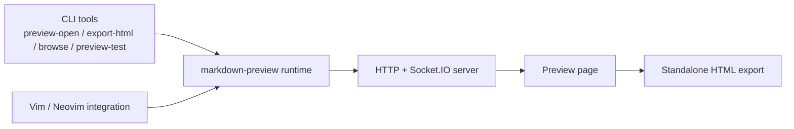

# markdown-preview

[English](./README.md) | [简体中文](./README_zh.md)

`markdown-preview` is a Markdown preview and export toolbox.

It gives you one local runtime with multiple entrypoints:

- CLI tools for browser preview, standalone HTML export, directory browsing, and Playwright validation
- a browser preview page with live rendering, TOC navigation, theme controls, and export actions
- an optional Vim/Neovim integration that reuses the same runtime instead of being the product center


## Quick Overview

- Live browser preview for Markdown content.
- Standalone HTML export with inlined assets.
- Directory browse mode for Markdown-heavy workspaces.
- Playwright-based preview verification for renderer and UI changes.
- Optional Vim/Neovim commands for people who want the toolbox inside the editor.
- Rich rendering support for KaTeX, PlantUML, Mermaid, Chart.js, flowchart.js, Graphviz/dot, js-sequence-diagrams, task lists, emoji, footnotes, definition lists, citations, TOC, and local images.

## Architecture



The runtime resolves its web assets from `app/runtime-asset-manifest.json`, which currently points at `dist/web` and `dist/static`.

## Install The Toolbox

Clone the repository and install the root dependencies:

```bash
git clone https://github.com/ZiYang-oyxy/markdown-preview.git
cd markdown-preview
yarn install
```

If you want to use the Playwright-based commands such as `preview-test` or the standalone HTML exporter on a fresh machine, install Chromium as well:

```bash
npx playwright install chromium
```

This is the default installation path for the toolbox itself.

## Use The Toolbox

### Open a local preview page

```bash
yarn preview-open -- test/demo.md
```

This starts the local preview runtime, opens `/page/1` in your browser, and keeps the server alive until you stop it.

### Export standalone HTML

```bash
yarn export-html -- test/demo.md -o ./demo.preview.html
```

The exporter launches a headless Chromium page, waits for the preview to finish rendering, then writes a self-contained HTML file with inlined assets.

### Browse a workspace

```bash
yarn browse -- .
```

Browse mode gives you a local file tree and opens Markdown files in the same preview runtime. Non-Markdown files fall back to text preview or download mode.

### Validate the preview with Playwright

```bash
yarn preview-test -- --fixture all
```

This runs browser-level preview checks and writes artifacts on failure.

### Shared CLI config

`preview-open`, `export-html`, and `browse` accept a JSON config file:

```json
{
  "theme": "dark",
  "pageTitle": "「${name}」",
  "markdownCss": "/absolute/path/to/markdown.css",
  "highlightCss": "/absolute/path/to/highlight.css",
  "imagesPath": "/absolute/path/to/images",
  "previewOptions": {
    "maid": {
      "themePreset": "warm"
    },
    "disable_filename": 0,
    "toc": {
      "listType": "ul"
    }
  }
}
```

Example:

```bash
yarn export-html -- test/demo.md --config ./mkdp.config.json
```

## Browser Preview Capabilities

The current preview page is much more than a plain Markdown renderer. It includes:

- light/dark theme switching from the page toolbar
- Mermaid theme presets: `modern`, `minimal`, `warm`, `forest`
- a responsive nested table of contents drawer
- clickable image and SVG preview interactions
- optional filename header hiding
- optional content-editable preview body
- an in-page export action plus `Ctrl/Cmd+Shift+E`

See [`test/demo.md`](test/demo.md) for an end-to-end fixture that exercises the current renderer stack.

## Vim / Neovim Integration

The editor integration is one consumer of the toolbox runtime, not the product definition.

### Install as a plugin integration

If you want to use `markdown-preview` from Vim or Neovim, install the repository with your plugin manager and then choose one runtime path.

#### Option A: prebuilt runtime download

Use the built-in installer to download the runtime bundle into `app/bin`:

```lua
{
  "ZiYang-oyxy/markdown-preview",
  ft = { "markdown" },
  cmd = {
    "MarkdownPreview",
    "MarkdownPreviewStop",
    "MarkdownPreviewToggle",
    "MarkdownPreviewExport",
    "MarkdownPreviewExportFile",
  },
  build = function()
    vim.fn["mkdp#util#install"]()
  end,
}
```

Equivalent `vim-plug` example:

```vim
Plug 'ZiYang-oyxy/markdown-preview', {
      \ 'do': { -> mkdp#util#install() },
      \ 'for': ['markdown', 'vim-plug']
      \ }
```

#### Option B: Node runtime inside the plugin

Install the app runtime dependencies under `app/`:

```lua
{
  "ZiYang-oyxy/markdown-preview",
  ft = { "markdown" },
  cmd = {
    "MarkdownPreview",
    "MarkdownPreviewStop",
    "MarkdownPreviewToggle",
    "MarkdownPreviewExport",
    "MarkdownPreviewExportFile",
  },
  build = "cd app && npx --yes yarn install",
}
```

Equivalent `vim-plug` example:

```vim
Plug 'ZiYang-oyxy/markdown-preview', {
      \ 'do': 'cd app && npx --yes yarn install',
      \ 'for': ['markdown', 'vim-plug']
      \ }
```

### Plugin commands

These commands remain buffer-local unless you enable `g:mkdp_command_for_global`.

| Command | What it does |
| --- | --- |
| `:MarkdownPreview` | Start the preview server if needed and open the browser page for the current buffer. |
| `:MarkdownPreviewStop` | Stop the preview server and close the current preview page. |
| `:MarkdownPreviewToggle` | Toggle preview for the current buffer. |
| `:MarkdownPreviewExport` | Ask the active preview page to generate a standalone HTML export and trigger a browser download. |
| `:MarkdownPreviewExportFile [output_path]` | Ask the active preview page to generate a standalone HTML export and write it to a file on disk. |

Available mappings:

- `<Plug>MarkdownPreview`
- `<Plug>MarkdownPreviewStop`
- `<Plug>MarkdownPreviewToggle`
- `<Plug>MarkdownPreviewExport`
- `<Plug>MarkdownPreviewExportFile`

The plugin also creates a default `<leader>me` mapping for `MarkdownPreviewExport` when that key is free.

### Plugin configuration

Global variables:

| Variable | Default | Notes |
| --- | --- | --- |
| `g:mkdp_auto_start` | `0` | Open preview automatically when entering a matching buffer. |
| `g:mkdp_auto_close` | `1` | Close the preview when the buffer becomes hidden. |
| `g:mkdp_refresh_slow` | `0` | When `1`, refresh on `CursorHold`, `BufWrite`, and `InsertLeave` instead of continuous cursor-driven refresh. |
| `g:mkdp_command_for_global` | `0` | Register the preview commands for all buffers instead of only configured filetypes. |
| `g:mkdp_open_to_the_world` | `0` | Bind the preview server to `0.0.0.0` instead of `127.0.0.1`. |
| `g:mkdp_open_ip` | `''` | Override the host part of the opened preview URL. Useful for remote editing. |
| `g:mkdp_browser` | `''` | Browser application or command passed to the opener. |
| `g:mkdp_echo_preview_url` | `0` | Echo the preview URL in the command line after opening it. |
| `g:mkdp_browserfunc` | `''` | Custom Vim function name that receives the preview URL. |
| `g:mkdp_markdown_css` | `''` | Absolute path to a custom `markdown.css`. |
| `g:mkdp_highlight_css` | `''` | Absolute path to a custom `highlight.css`. |
| `g:mkdp_port` | `''` | Fixed preview port. When empty, the plugin chooses a pseudo-random port. |
| `g:mkdp_page_title` | `'「${name}」'` | Preview page title template. |
| `g:mkdp_images_path` | `''` | Override the base directory used for resolving local images. |
| `g:mkdp_filetypes` | `['markdown']` | Filetypes that receive the buffer-local preview commands. |
| `g:mkdp_theme` | unset | Optional preview theme override. Use `'light'` or `'dark'`. |
| `g:mkdp_combine_preview` | `0` | Reuse one preview page for multiple Markdown buffers. |
| `g:mkdp_combine_preview_auto_refresh` | `1` | When combine preview is on, switch the shared page to the buffer you just entered. |
| `g:mkdp_preview_options` | see below | Rendering and UI options forwarded to the preview page. |

Default `g:mkdp_preview_options`:

```vim
let g:mkdp_preview_options = {
      \ 'mkit': {},
      \ 'katex': {},
      \ 'uml': {},
      \ 'maid': {},
      \ 'disable_sync_scroll': 0,
      \ 'sync_scroll_type': 'middle',
      \ 'hide_yaml_meta': 1,
      \ 'sequence_diagrams': {},
      \ 'flowchart_diagrams': {},
      \ 'content_editable': v:false,
      \ 'disable_filename': 0,
      \ 'toc': {}
      \ }
```

Example plugin config:

```lua
vim.g.mkdp_auto_start = 0
vim.g.mkdp_echo_preview_url = 1
vim.g.mkdp_theme = "dark"
vim.g.mkdp_filetypes = { "markdown", "mdx" }
vim.g.mkdp_preview_options = {
  disable_filename = 0,
  content_editable = false,
  sync_scroll_type = "relative",
  toc = {
    listType = "ul",
  },
  maid = {
    themePreset = "forest",
  },
}
```

Custom browser callback example:

```vim
function! OpenMarkdownPreview(url)
  execute 'silent !firefox --new-window ' . shellescape(a:url)
endfunction
let g:mkdp_browserfunc = 'OpenMarkdownPreview'
```

If you enable `g:mkdp_combine_preview`, also set `g:mkdp_auto_close = 0` so the shared page is not closed when you switch buffers.

## Renderers And Formats

The runtime is built around `markdown-it` plus extensions for:

- fenced code highlighting with `highlight.js`
- task lists
- emoji
- footnotes
- definition lists
- heading anchors
- generated table of contents
- YAML front matter hiding
- citations
- local image rewriting
- inline image size syntax via `markdown-it-imsize`
- line number markers for sync scroll
- KaTeX for inline and block math
- PlantUML from fenced `plantuml` blocks and `@startuml ... @enduml`
- Mermaid fenced blocks and keyword-first Mermaid blocks
- Chart.js from fenced `chart` JSON
- flowchart.js from fenced `flowchart` blocks
- Graphviz/Viz.js from fenced `dot` or `graphviz` blocks
- js-sequence-diagrams from fenced `sequence-diagrams` blocks

## Development

Repository layout:

- `plugin/` and `autoload/`: Vimscript commands, config defaults, autocmds, RPC bridge, and health checks
- `src/`: TypeScript sources for the Node attach/runtime loader
- `app/`: preview server, Next-based preview page, runtime asset manifest, and install helpers
- `dist/`: exported web assets used by the runtime
- `scripts/`: build, browse, export, preview-open, and preview-test helpers
- `test/`: Node regression tests and Markdown fixtures

Useful commands:

```bash
yarn build-lib
```

```bash
yarn build-app
```

```bash
node test/runtime-asset-layout.test.js
```

```bash
node test/browse-service.test.js
```

```bash
yarn preview-test -- --fixture demo
```

There is no single `yarn test` entry today; run the specific scripts you need.

## Troubleshooting

### The toolbox CLI does not start correctly

- Run `yarn install` at the repo root.
- For Playwright-backed flows, run `npx playwright install chromium`.
- Use the `--help` output of each script to confirm arguments:
  - `node scripts/mkdp-open-preview.js --help`
  - `node scripts/mkdp-export-html.js --help`
  - `node scripts/mkdp-browse.js --help`
  - `node scripts/mkdp-test-preview.js --help`

### `:MarkdownPreview` does not open anything

- Run `:checkhealth mkdp` in Neovim.
- Make sure you completed one plugin runtime setup path:
  - `call mkdp#util#install()` downloaded the prebuilt runtime into `app/bin`, or
  - `cd app && npx --yes yarn install` installed the Node runtime dependencies.
- If the default opener is wrong, set `g:mkdp_browser` or `g:mkdp_browserfunc`.

### `:MarkdownPreviewExportFile` fails

The export path requires an active preview client. Open the page with `:MarkdownPreview` first, then run `:MarkdownPreviewExportFile`.

### Remote or WSL workflows

Use `g:mkdp_open_ip` or a custom `g:mkdp_browserfunc` when the editor and the browser do not live on the same machine.

## License

MIT
