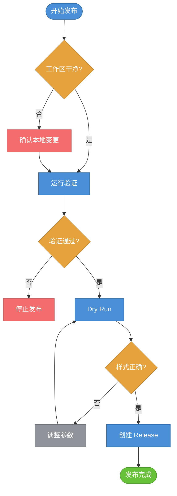

# GitHub Release SOP

本 SOP 用于发布 `markdown-preview.nvim` 的 GitHub Release。目标是固定发布样式、验证步骤和补救入口，避免每次手工创建 release 时出现标题、正文结构或命令格式不一致。

## 发布流程



## 标准命令

先运行验证：

```bash
node test/browse-service.test.js
yarn build-lib
yarn build-app
```

发布前预览 release 样式：

```bash
yarn release:github --dry-run
```

创建新的 browse release：

```bash
yarn release:github
```

更新已有 release 的样式：

```bash
yarn release:github --edit --tag browse-v0.0.10
```

## 样式规范

Release 正文必须使用固定结构：

- 第一段：一句话说明本次发布用途。
- `Highlights:`：用户可感知变化列表。
- `Install / update:`：安装或更新命令代码块。
- `Verification:`：发布前实际执行的验证命令代码块。

脚本入口：

```bash
node scripts/mkdp-release-github.js
```

常用参数：

- `--tag <tag>`：release tag，默认 `browse-v<package.json version>`。
- `--title <title>`：release 标题，默认 `Markdown Preview Toolbox Browse UI v<version>`。
- `--target <rev>`：tag 指向的提交，默认 `HEAD`。
- `--summary <text>`：正文第一段。
- `--highlight <text>`：可重复传入，生成 `Highlights:` 列表。
- `--install <cmd>`：可重复传入，生成安装命令代码块。
- `--verify <cmd>`：可重复传入，生成验证命令代码块。
- `--asset <path>`：可重复传入，创建 release 时上传资产。
- `--edit`：更新已有 release。
- `--dry-run`：只打印标题、正文和 `gh` 命令，不调用 GitHub。

## 补救步骤

如果 release 样式不对，不要新建另一个 release。使用 `--edit` 修正原 release：

```bash
yarn release:github --edit --tag <existing-tag>
```

如果 tag 指错提交，先确认 GitHub 上没有用户依赖该 tag，再手工处理 tag。不要在 `master` 上 force push。
