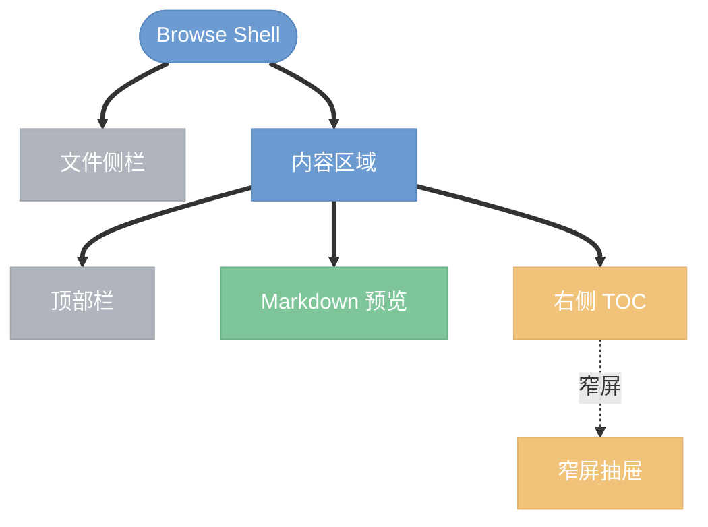
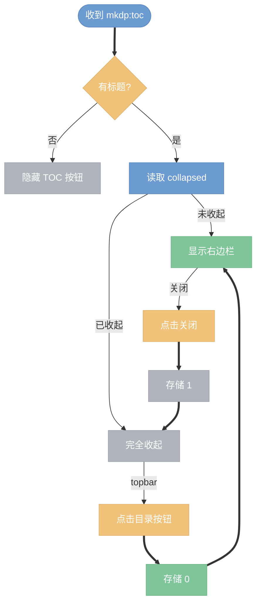

# Browse 固定右侧 TOC 设计

## 目标

- 将 browse 模式中的 TOC 从右上浮动小窗改为稳定的右侧栏。
- 右侧栏可完全收起，收起后正文区域自动变宽。
- 保留现有树形目录、节点折叠、活跃标题同步和窄屏抽屉行为。

## 背景

当前 browse shell 已经具备树形 TOC 和 `mkdp-toc-collapsed` 本地状态，但 TOC 容器仍位于 `.content-body` 内部，以浮层形式贴在右上角。这个形态会带来两个问题：

- **视觉割裂**：TOC 看起来像覆盖在文档上的独立卡片，不像工作区右边栏。
- **内容遮挡**：长文档或宽内容场景下，浮层可能遮挡正文。

本次只调整 browse shell 的 TOC 布局和收起交互，不改变 iframe 内 markdown 渲染页的职责。

## 布局设计

宽屏下，`.content` 内部改为两层：

- `content-topbar`：保持在上方，横跨预览与 TOC 区域。
- `content-workspace`：承载 `content-body` 和新的 `toc-sidebar`。

`toc-sidebar` 是真实布局列，不再绝对定位。展开时占固定宽度；收起时隐藏该列，`content-body` 自动填满剩余空间。

## 交互设计

### 宽屏

- 有目录时默认显示右侧 TOC，除非 `localStorage.mkdp-toc-collapsed` 为 `1`。
- 右侧栏关闭按钮会完全隐藏 TOC，并写入 `mkdp-toc-collapsed=1`。
- topbar 目录按钮始终作为重新打开入口，点击后写入 `mkdp-toc-collapsed=0`。
- TOC 展开后不遮挡正文；正文宽度由布局自然计算。

### 窄屏

- 保留现有 drawer 行为。
- topbar 目录按钮打开 drawer，不改变宽屏的收起持久化语义。
- drawer 和右侧栏继续复用同一套树形渲染函数与展开状态。

## 组件边界

| 模块 | 职责 | 本次变化 |
| --- | --- | --- |
| `scripts/lib/standalone-preview-server.js` | browse shell、布局、TOC 容器、事件处理 | 修改 |
| `app/pages/index.jsx` | iframe 文档渲染、发送 TOC 和 active heading | 不改 |
| `app/_static/page.css` | iframe 内文档样式 | 不改 |
| `test/*.test.js` | browse 行为回归测试 | 按需新增或扩展 |

## 数据流

- iframe 继续发送 `mkdp:toc`，payload 为 `{ headings: [{ id, text, level }] }`。
- shell 继续用 `buildTocTree()` 将 flat headings 转为树。
- iframe 继续发送 `mkdp:active-heading`，shell 自动展开活跃节点祖先。
- shell 点击 TOC 链接后继续向 iframe 发送 `mkdp:scroll-to`。

## 样式要求

- 右侧栏宽度建议为 `220px` 到 `260px`，使用 CSS 变量或单处常量管理。
- 右侧栏使用 shell 现有色彩变量：`--surface`、`--border`、`--muted`、`--accent`。
- 右侧栏不使用大阴影浮层效果，避免继续呈现“卡片悬浮”观感。
- 标题行包含 “On this page” 和关闭按钮，关闭按钮沿用现有 `.toc-drawer-close` 或拆出通用按钮样式。

## 测试计划

- 扩展 browse shell HTML 结构测试：
  - 存在 `content-workspace` 与 `toc-sidebar`。
  - TOC 不再挂在 `content-body` 内作为浮层主容器。
  - `mkdp-toc-collapsed` 的读写逻辑仍存在。
- 运行现有测试：
  - `node test/browse-service.test.js`
  - 如涉及 shell HTML 快照或结构断言，运行对应 browse UI 测试。

## 非目标

- 不重做左侧文件栏。
- 不调整 iframe 内 markdown 样式。
- 不改变 TOC 数据协议。
- 不新增全局设置页或额外配置项。
