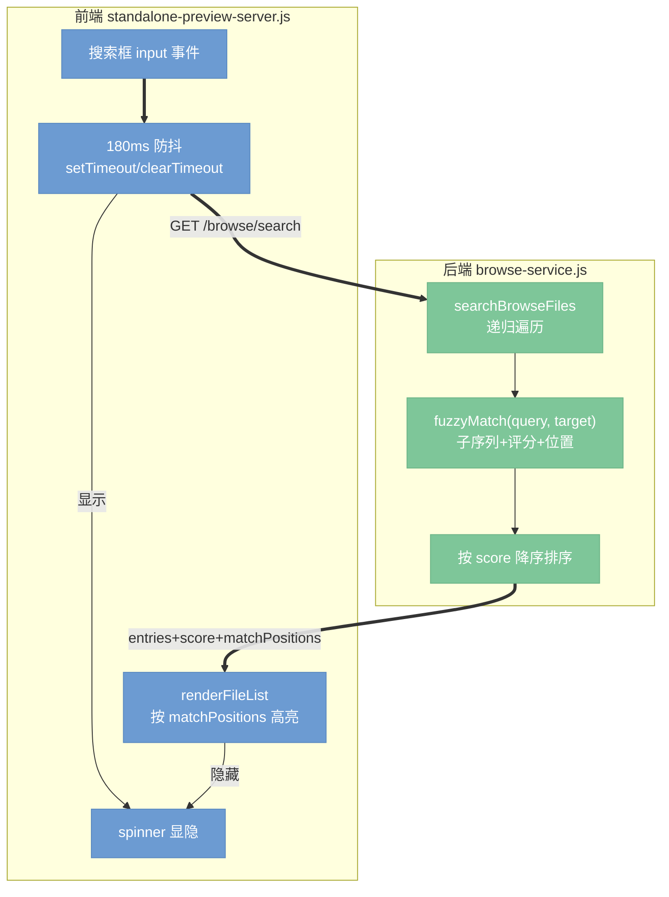

# Browse 搜索框 fzf 风格模糊检索设计

> 日期：2026-06-02
> 范围：`scripts/lib/browse-service.js`、`scripts/lib/standalone-preview-server.js`、`test/browse-service.test.js`

## 1. 背景与目标

当前 browse 侧边栏搜索框（`searchBrowseFiles` + 前端 `input` 监听器）存在三个体验短板：

- **纯子串匹配**：`name.toLowerCase().includes(query)`，输入 `bd` 无法命中 `build`（不含连续 `bd`），不符合用户对 fzf 的预期。
- **无防抖**：每次 `input` 事件立即发请求，连续敲键浪费请求、大目录下抖动。
- **无搜索中提示**：请求期间无任何反馈，大目录下用户会以为页面卡死。

目标：让搜索框具备 **fzf 风格子序列模糊匹配 + 评分排序 + 命中高亮**，输入 **180ms 防抖**，搜索进行中在**搜索框内显示 spinner**。

## 2. 需求决策（已与用户确认）

| 维度 | 决策 |
|------|------|
| 匹配范围 | **完整相对路径**（如 `app/build/foo.md`），路径段也可被检索 |
| 排序 | **按匹配分数排序**（连续/词首/分隔符后加分，距离惩罚） |
| 评分位置 | **后端** `browse-service.js` |
| 防抖延迟 | **180ms** |
| 搜索中提示 | **搜索框右侧 spinner** |
| 命中高亮 | **高亮匹配字符**（后端返回匹配位置，前端高亮） |

## 3. 架构

## 4. 后端实现（browse-service.js）

### 4.1 新增纯函数 `fuzzyMatch(query, target)`

经典 fzf 子序列评分算法，与 `searchBrowseFiles` 解耦，便于单测。

- **返回**：不命中返回 `null`；命中返回 `{ score: number, positions: number[] }`（`positions` 为命中字符在 `target` 中的索引，升序）。
- **大小写**：smart-case —— 查询全小写则忽略大小写；查询含大写则区分大小写。
- **匹配**：要求查询字符按顺序作为 target 的子序列出现（贪心 + 对每个查询字符择优）。
- **评分规则**：
  - 基础：每命中一个字符加基础分。
  - 连续命中（bonus consecutive）：上一个命中字符的下一位即命中，加连续分。
  - 边界加分：命中字符紧跟在分隔符（`/ - _ . 空格`）之后，或位于 target 开头，或为驼峰边界（小写→大写）。
  - 惩罚：首次命中前跳过的字符（leading gap）轻惩罚；命中之间的间隔惩罚。
- **实现取舍**：用单遍贪心 + 边界加分即可满足体验，不引入完整 DP 矩阵（YAGNI），保持代码可读、可测。

### 4.2 改写 `searchBrowseFiles`

- 保持现有目录递归遍历、`isIgnoredBrowseDirectory`、symlink/outsideRoot 安全检查、`isDisplayableFile` 过滤不变。
- 对每个文件，用 `fuzzyMatch(normalizedQuery, entryRelativePath)` 替换原 `name.includes`。
  - 注：查询归一化沿用现有 `String(query||'').trim()`；smart-case 由 `fuzzyMatch` 内部处理，调用方传原始 trim 后的查询（不再强制 toLowerCase，以支持 smart-case）。
- 命中的 entry 附加 `score` 与 `matchPositions`（即 `positions`，相对于 `relativePath`）。
- 最终排序：`score` 降序；同分时按 `relativePath.localeCompare` 升序（稳定、可预测）。
- 空查询行为不变（返回空 entries）。

### 4.3 导出

`module.exports` 增加 `fuzzyMatch`，供单测直接覆盖。

## 5. 前端实现（standalone-preview-server.js）

### 5.1 防抖 + spinner（约 951–980 行区域）

- 模块级新增 `var searchDebounceTimer = null;`
- `searchInput` 的 `input` 监听器：
  - 取 `q = searchInput.value.trim()`（不再预先 toLowerCase，交由后端 smart-case；前端高亮也需原始大小写位置一致）。
  - 空查询：清除 timer、隐藏 spinner、立即 `searchCurrentDirectory('')`（走清空分支）。
  - 非空：`clearTimeout` 旧 timer，显示 spinner，`setTimeout(() => searchCurrentDirectory(q), 180)`。
- `searchCurrentDirectory`：
  - 请求结束（`finally`，且 `requestId === searchRequestId` 时）隐藏 spinner，避免被后发请求覆盖时提前隐藏。
  - 保留现有 `searchRequestId` 竞态保护。
- 切换目录（`loadDirectory`）时清除 debounce timer、隐藏 spinner（与现有 `searchInput.value=''` 同处理）。

### 5.2 spinner 元素与样式

- HTML：在 `.sidebar-search` 内、`input` 之后加 ``，默认隐藏。
- CSS：
  - `.search-spinner`：绝对定位于输入框右侧（对称于左侧 `.search-icon`），`14px` 圆环，`border` + `border-top-color: var(--accent)`，`@keyframes mkdp-spin` 旋转 0.6s 线性循环，默认 `display:none`。
  - `.search-spinner.is-active { display:block }`。
- 显隐通过 toggle `is-active` class。

### 5.3 命中高亮（renderFileList，约 1014–1035 行）

- entry 带 `matchPositions`（相对 `relativePath`）时，将位置映射到展示字段：
  - `file-name`（basename）高亮：取落在 basename 区间内的位置。
  - `file-meta`（目录段，搜索态下显示路径目录部分）高亮：取落在目录段区间的位置。
- 高亮渲染：把命中字符包进 ``，其余文本用 `textContent` 等价的转义拼接（避免 XSS，文件名来自本地磁盘但仍统一走转义）。新增小工具函数 `highlightByPositions(text, baseOffset, positions)` 返回安全 HTML 片段。
- CSS `.match-hl`：`color: var(--accent); font-weight:600;`（不加背景，保持简洁）。
- 无 `matchPositions`（如目录浏览态）时退化为现有 `textContent` 渲染。

## 6. 测试（test/browse-service.test.js）

新增覆盖：

- `fuzzyMatch` 单元：
  - `bd` 命中 `build`，positions 正确；不命中 `abc`。
  - smart-case：`Bd` 不命中 `build`（含大写区分）；`bd` 命中 `Build`。
  - 连续匹配得分 > 分散匹配（`build` 对查询 `bui` 高于 `bxuxi`）。
  - 边界加分：词首/分隔符后命中得分更高。
- `searchBrowseFiles` 集成：
  - 跨路径段命中（查询命中 `dir/build.md` 的路径段）。
  - 结果按 score 降序，同分按路径序。
  - 空查询返回空。
  - 保持忽略目录、symlink 安全检查不被破坏（沿用现有夹具）。

## 7. 构建产物

参照历史提交 `a031dff build: rebuild preview assets`：本次仅改 `scripts/lib/*`（standalone server 在运行时直接读取，非打包进 `dist/web`），**预计无需重建 dist**。落地时确认 standalone server 不经构建步骤；若 e2e 测试经由构建路径则补 `dist` 重建。

## 8. 非目标（YAGNI）

- 不做完整 fzf DP 评分矩阵。
- 不做正则/精确模式切换、不做多词 AND（`'foo bar'`）语法。
- 不改目录浏览（非搜索态）的列表行为。
- 不做搜索历史、键盘上下选择导航。
