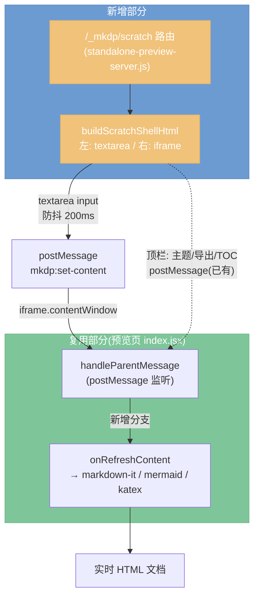

# Browse Scratch 粘贴渲染页 — 设计文档

- **日期**: 2026-06-02
- **状态**: 待实现
- **作者**: brainstorming 会话

## 1. 目标

给 browse 新增一个**独立的草稿粘贴页面**(`/_mkdp/scratch`),让用户把任意 markdown 文本贴进左侧输入框,右侧实时渲染成 HTML 文档。渲染完全复用现有的预览管线(markdown-it、mermaid、katex、导出 HTML、主题切换等),保证粘贴内容与打开文件的渲染效果 100% 一致。

### 非目标 (YAGNI)
- 不引入代码编辑器(CodeMirror 等),输入框就是纯 `<textarea>`。
- 不做草稿持久化/多标签/历史记录。
- 不在前端重新搭一套 markdown 渲染。
- 不改动 browse 文件树或现有文件预览流程。

## 2. 关键决策(brainstorming 已确认)

| 维度 | 决策 |
| --- | --- |
| 入口定位 | **独立路由** `/_mkdp/scratch`,与 browse 文件树解耦 |
| 渲染方式 | **复用现有渲染管线**(预览 iframe + markdown-it 全套插件) |
| 内容通道 | **postMessage** — 父页面 `postMessage({type:'mkdp:set-content', content})` 推给 iframe |
| 布局/输入 | **左右双栏 + 纯 textarea**,中间可拖拽分隔条,复用顶栏工具按钮 |

## 3. 架构



**核心洞察**: 预览页(`app/pages/index.jsx`)已通过 socket `refresh_content` 接收 `{content: [...lines]}` 渲染;`handleParentMessage` 已是成熟的 postMessage 入口(含 `set-theme`/`export`/`scroll-to` 等分支)。本功能只需新增一个 `mkdp:set-content` 分支,把文本喂进同一个 `onRefreshContent` 渲染入口。

## 4. 组件设计

### 4.1 服务器路由 (`scripts/lib/standalone-preview-server.js`)

- 在 `handleRequest` 中新增分支:`pathname === '/_mkdp/scratch'` (含尾斜杠) → 返回 `buildScratchShellHtml(...)`。
- **不依赖 `context.browseRoot`** — 粘贴文本与文件系统无关,即使未启用 browse 也能用该页面。
- iframe 指向 `/page/1`(**不带** `browsePath`)。socket 握手时无 `browsePath`,服务器走默认 `buildPreviewPayload(context)`,初始渲染空文档/占位。
- 在 `module.exports` 暴露 `buildScratchShellHtml`(与现有 `buildBrowseShellHtml` 平行)。

### 4.2 Scratch Shell 页面 (`buildScratchShellHtml`)

内联 CSS/JS 单页,复用 browse shell 的 CSS 变量与视觉风格:

- **布局**: flex 双栏。左 `<textarea>` 输入区 / 右预览 `<iframe>` (`src=/page/1`) / 中间可拖拽分隔条调节宽度。
- **顶栏**: 复用现有工具按钮(主题切换、导出 HTML、TOC),通过 `previewFrame.contentWindow.postMessage(...)` 转发(沿用 browse shell 既有模式)。
- **输入驱动**:
  - textarea `input` 事件 → 防抖 200ms → `postMessage({type:'mkdp:set-content', content: value.split(/\r?\n/)})`。
  - iframe **未 `load` 完成前**缓存最新内容,`load` 事件后补推首帧(避免丢首帧)。
  - 空输入推送占位提示或空内容。
- **粘贴友好**: textarea 支持直接 `Ctrl/Cmd+V` 粘贴大段文本,防抖避免逐字符渲染卡顿。

### 4.3 预览页新增分支 (`app/pages/index.jsx`)

- 在 `handleParentMessage` 中新增:
  ```js
  if (event.data.type === 'mkdp:set-content') {
    const content = Array.isArray(event.data.content)
      ? event.data.content
      : String(event.data.content || '').split(/\r?\n/)
    this.onRefreshContent({ content, name: 'scratch' })
    return
  }
  ```
- 复用 `onRefreshContent` 渲染入口(其内部完成 markdown-it 渲染、mermaid/katex 处理、TOC 上报等),无需新建渲染逻辑。
- 注意 `onRefreshContent` 的参数有默认值(`name=''`、`options` 等),`set-content` 只传必要字段;若首帧 `this.md` 尚未初始化由其内部惰性初始化处理(与 socket 路径一致)。

## 5. 数据流

```
用户在 textarea 输入/粘贴
  → 防抖 200ms
  → 父页面 postMessage({type:'mkdp:set-content', content:[...lines]})
  → iframe handleParentMessage 捕获
  → onRefreshContent({content})
  → markdown-it.render + mermaid/katex
  → 右侧 iframe 显示 HTML
```

## 6. 错误处理与边界

- **iframe 未就绪**: 父页面缓存最新内容,监听 iframe `load` 后补推首帧。
- **渲染语法错误**(mermaid/katex 等): 由现有渲染管线自行处理,行为与文件预览一致。
- **安全**: 路由不读文件系统、不依赖 browseRoot,无路径越权风险;postMessage 在同源 iframe 间通信。
- **大文本**: 防抖 + 一次性 split,避免逐字符触发渲染。

## 7. 构建与产物同步

预览页源码 `app/pages/index.jsx` 改动后必须重新构建:

- 构建命令: `yarn build-app`(`scripts/mkdp-build-app.js`) 生成 `app/out/` Next.js 产物。
- 需确认 `dist/web/` 是否为发布产物、是否需要同步(实现阶段核对 `release.sh` / `mkdp-build-app.js`)。
- Shell 改动(`standalone-preview-server.js`)为纯 Node 运行时,无需 Next 构建。

实现步骤顺序: **改源码 → 重新构建 → 验证产物 → 测试**。

## 8. 测试

沿用现有测试模式(`scripts/mkdp-test-preview.js`、`test/*.test.js`、Playwright):

- **路由测试**: `GET /_mkdp/scratch` 返回 200 且含 textarea + iframe 结构;未启用 browseRoot 时仍可用。
- **渲染测试**(Playwright): 打开 scratch 页 → 在 textarea 注入 markdown → 断言 iframe 内渲染出对应 HTML(标题、代码块、列表等)。
- **回归**: 现有 browse / 文件预览路径不受影响(`mkdp:set-content` 是新增分支,不改动既有分支)。

## 9. 影响文件清单

| 文件 | 改动 |
| --- | --- |
| `scripts/lib/standalone-preview-server.js` | 新增 `/_mkdp/scratch` 路由 + `buildScratchShellHtml` + 导出 |
| `app/pages/index.jsx` | `handleParentMessage` 新增 `mkdp:set-content` 分支 |
| `app/out/` (及视情况 `dist/web/`) | 重新构建产物 |
| `test/` | 新增 scratch 路由 + 渲染测试 |
| `scripts/mkdp-browse.js` 或新 CLI | (可选)打印 scratch 入口 URL,实现阶段定 |
