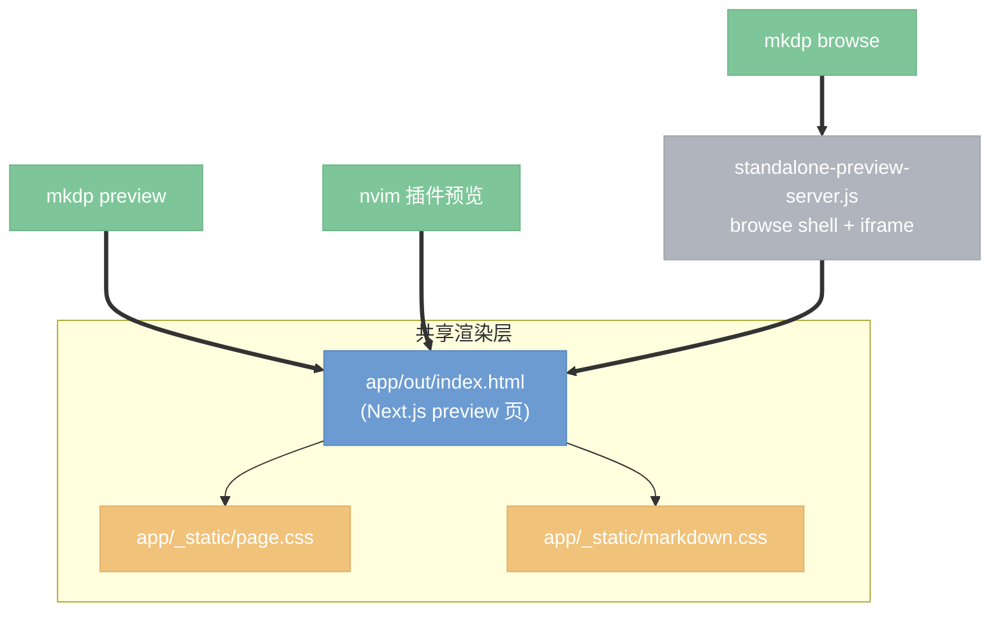

# 文档扁平化（去卡片悬浮）与 TOC 统一右置设计

## 目标

将 `mkdp browse`、`mkdp preview`、nvim 插件预览三个界面统一为**扁平、无卡片悬浮**的现代文档站风格：

- **文档去卡片**：正文 `.markdown-body` 不再带边框、阴影、圆角，背景与页面融为一体，不再像「悬浮卡片」。
- **TOC 去悬浮**：preview/nvim 的右侧 TOC 去掉圆角、阴影、blur、填充背景，仅保留分割线作区隔；browse 模式右侧 TOC 同步去掉灰底填充。
- **TOC 统一右置**：preview/nvim 模式的 TOC 从左侧移到右侧，与 browse 模式一致。
- **Header 扁平化**：preview/nvim 文档上方的文件名/工具行去掉卡片样式，仅保留底部一条分割线。

保留范围：左侧文件栏、整体配色、字体、间距、TOC 现有的树形/折叠/活跃标题同步行为均**不改动**。本次只处理「卡片悬浮感」与「TOC 位置」。

## 背景

三个界面共享同一套渲染页面与样式：

- `mkdp preview` 与 nvim 插件加载同一个 `app/out/index.html`（或 `dist/web/index.html`），使用同一套 `page.css` + `markdown.css`。
- `mkdp browse` 通过 iframe 嵌入同一个 preview 页，外层由 `scripts/lib/standalone-preview-server.js` 的 `buildBrowseShellHtml()` 提供 shell（侧栏 + 右侧 TOC）。browse 模式下 preview 页自带的 header/toolbar/TOC 通过 `.mkdp-browse-mode` 类隐藏，由外层 shell 替代。

因此「去卡片」改一处共享 CSS 即可三处生效；「TOC 移到右侧」只影响 preview/nvim 模式的桌面布局。

## 现状问题定位

通过实际运行 `mkdp browse` 打开 README.md，结合浏览器审查，精确定位「卡片悬浮」来源：

| 元素 | 文件 / 行 | 悬浮样式 |
|------|----------|---------|
| `.markdown-body` | `markdown.css` | `border: 1px solid` + `border-radius` |
| `#page-ctn .markdown-body` | `page.css:219-221` | `box-shadow: var(--shadow-soft)` |
| browse / header-hidden 模式 | `page.css:230` / `page.css:715` | `border-radius: 14px` |
| `#toc-panel`（preview/nvim） | `page.css:372-384` | `border-radius:16px` + `box-shadow` + `backdrop-filter:blur` + 填充 `background` |
| `#page-header`（preview/nvim） | `page.css:103-117` | `border` + `border-radius:14px` + `box-shadow` + `backdrop-filter:blur` + 填充 `background` |
| `.toc-sidebar`（browse） | `standalone-preview-server.js` 内联 CSS | `#f8f9fa` 灰底填充（带左 1px 边框，非悬浮） |

TOC 当前位置：

- **preview / nvim**：`page.css:79-84` 的 `#page-shell` grid 为 `minmax(260px,320px) minmax(0,1fr)`，即 **TOC 在左、内容在右**。
- **browse**：右侧（`standalone-preview-server.js` 中 `.content-workspace` grid 为 `1fr 240px`），已符合目标。
- **窄屏抽屉**：`page.css:621-634` 的 `#toc-panel` 已经是 `right:0` + `translateX(104%)`，**本来就从右侧滑入**，无需调整方向。

## 改动清单

### A. 文档去卡片 — `markdown.css` + `page.css`

- `markdown.css` `.markdown-body`：移除 `border`、`border-radius`（含 `-webkit-border-radius`）。背景保持 `var(--color-bg-primary)`，但由于将与页面背景统一，视觉上不再是独立卡片。
- `page.css:219-222` `#page-ctn .markdown-body`：移除 `box-shadow` 与 `border-color`。
- `page.css:224-231` `#page-ctn.with-header` / `#page-ctn.header-hidden` 的 `border-radius`：移除（含窄屏 `page.css:578-584` 的 12px 圆角）。
- `page.css:713-716` `.mkdp-browse-mode #page-ctn .markdown-body` 的 `border-radius:14px`：移除。
- 页面背景统一：`.mkdp-browse-mode main` 当前为 `var(--secondary-background-color)`（`page.css:719-722`），调整为与文档背景一致，消除文档块与外层的色差；preview/nvim 的 `main` 背景同样确保与文档同色。

### B. TOC 去悬浮 — `page.css:372-384`

- `#toc-panel`（桌面 sticky 态）：移除 `border-radius:16px`、`box-shadow`、`backdrop-filter`、填充 `background`、`border`。
- 保留一条分割线作区隔：TOC 在右侧，分割线落在其左边（`border-left: 1px solid var(--border-color-soft)`）。
- `#toc-header` 的 `border-bottom`（`page.css:391`）保留，作为 TOC 标题与列表的分隔。
- 窄屏抽屉态（`page.css:621-634`）：抽屉是浮层，保留 `box-shadow` 以表达层级；圆角 `border-radius:18px 0 0 18px` 可弱化但非必须，保持现状即可。

### C. TOC 移到右侧 — `page.css:79-91`

- `#page-shell` 桌面 grid：`grid-template-columns` 从 `minmax(260px,320px) minmax(0,1fr)` 改为 `minmax(0,1fr) minmax(260px,320px)`，使内容在左、TOC 在右。
- DOM 顺序：若 `#toc-panel` 在 `#content-col` 之前，需通过 `order` 或调整 grid 放置使视觉顺序为 `[内容][TOC]`；优先用 CSS（`order` 或 grid 显式列）实现，避免改动 React 结构。
- 中等宽度断点（`page.css:542-543`）的两列 grid 同步调整为内容在左、TOC 在右。
- `#content-col` 相关左边距（如 `page.css:703-705` 在 browse 模式的 `margin-left:0`）按新列顺序复核。
- 窄屏抽屉：无需改方向（已从右滑入）。

### D. Header 扁平化 — `page.css:103-117`

- `#page-header`：移除 `border`、`border-top-left-radius`/`border-top-right-radius`、`box-shadow`、`backdrop-filter`、填充 `background`。
- 保留 `border-bottom: 1px solid var(--border-color)` 作为标题工具行与正文之间的分割线。
- 窄屏 `page.css:567-572` 的 header 圆角同步移除。
- browse 模式不受影响（header 已被 `.mkdp-browse-mode` 隐藏）。

### E. browse 模式 TOC 统一 — `standalone-preview-server.js`

- `.toc-sidebar` 内联 CSS：移除 `background: var(--surface)` 灰底填充，保留左侧 `1px` 分割线（`border-left`），使其与 preview/nvim 的右侧 TOC 外观一致（无填充背景、仅分割线）。
- 若 `.content-topbar` 的灰底（`var(--surface)` + 下边框）也造成「文档上方一条灰带」的割裂感，一并评估是否扁平化为透明 + 仅下边框（与 D 项 header 处理对齐）。

### F. 构建产物同步

- 改动 `app/_static/page.css` 与 `app/_static/markdown.css` 后，按项目惯例（参见提交 `0f69d89` "chore(build): sync dist into git index after build"）将对应 `dist/web/_static/*.css` 同步进 git，确保发布包与源码一致。
- 确认是否需要重新执行构建脚本，或仅同步静态 CSS（静态 CSS 改动通常无需重新编译 Next.js chunks，但需验证 `dist/web` 与 `app/out` 两处 CSS 是否都需更新）。

## 验证

1. **browse 模式**：运行 `node scripts/mkdp-browse.js .`，打开 README.md，截图确认：文档无边框/阴影/圆角、不再像悬浮卡片；右侧 TOC 无灰底、仅分割线。
2. **preview 模式**：运行 `mkdp preview`（或 `scripts/mkdp-open-preview.js`）打开一个含多级标题的 markdown，确认：TOC 在**右侧**、无悬浮卡片；header 为扁平工具行 + 底部分割线；文档平铺无卡片。
3. **窄屏**：缩小窗口，确认 TOC 抽屉仍从右侧滑入、活跃标题同步、折叠展开正常。
4. **回归**：对照本次 brainstorm 记录的浏览器基线截图（`browse-readme-current.png`），逐项核对四类改动均生效且无样式回归（代码高亮、Mermaid、KaTeX、图片 lightbox 不受影响）。
5. **dark 主题**：切换暗色主题，确认去卡片后文档与页面背景在暗色下也统一、分割线可见且不刺眼。

## 不在本次范围

- 左侧文件栏的结构、配色、字体、间距（保持现状）。
- TOC 的树形/折叠/活跃标题同步逻辑（仅改外观与位置，不改行为）。
- 任何与卡片悬浮、TOC 位置无关的重构。
