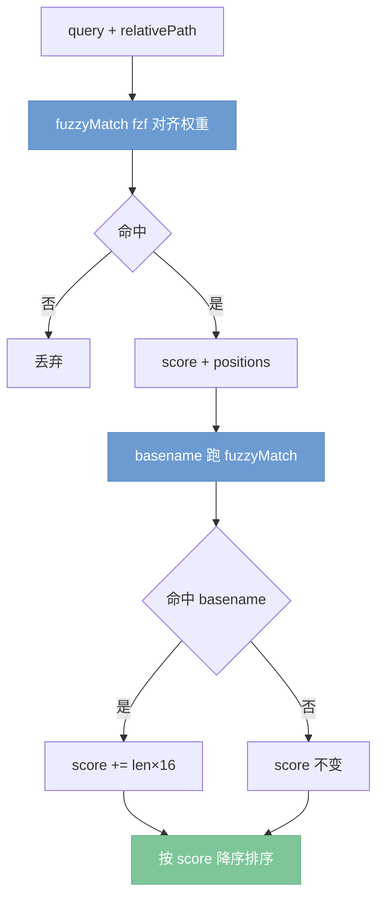

# Browse fzf 搜索排序修复设计

## 背景与问题

browse 侧边栏的文件搜索使用自制简化版 fzf（`browse-service.js` 的 `fuzzyMatch`），在**完整相对路径**上做子序列匹配。实际使用中出现反直觉排序：搜索 `design` 时，文件名末尾含完整连续 `design` 的文件（如 `docs/.../2026-06-02-browse-fzf-search-design.md`）排在跨多个目录段散落匹配的文件（如 `.worktrees/.../scripts/lib/github-release-notes.js`）**之后**。

### 根本原因（已复现验证）

复现脚本对图中真实候选打分，得到散落匹配 `github-release-notes.js` = 7 分，连续匹配 `...-design.md` = 6 分。两个设计缺陷：

1. **量级失衡**：旧权重 `base=1` 相对 `boundary=8` 过小，总分几乎完全由"跨过多少路径分隔符边界"主导。长目录路径里散落匹配每经过一个 `/`、`-` 都吃到 +8，累加反超连续匹配。
2. **首字符长 gap 被截断**：旧 gap 罚则 `-min(gap, 6)` 把惩罚封顶在 -6。`design` 前隔了 30+ 字符目录前缀，惩罚严重不足。

fzf 官方 `algo.go` 的真实常量 `scoreMatch=16` 远大于 `bonusBoundary=8`，正是为修正"gapped matches 反超 consecutive matches"这一 anomaly。旧实现踩进了该 anomaly。

## 约束

- **匹配域不可改**：必须在完整 `relativePath` 上匹配。前端 `server.js:1027 highlightByPositions` 依赖 `matchPositions` 是 relativePath 的下标，分别高亮文件名（减 nameOffset）和目录前缀（offset 0）。改为纯 basename 匹配会破坏目录段高亮。
- **返回结构不变**：`fuzzyMatch` 仍返回 `{ score, positions }`，positions 语义不变。
- **两副本同步**：`packages/cli/lib/browse-service.js` 与 `scripts/lib/browse-service.js` 当前逐字节一致，必须同步并以 `diff` 校验。

## 设计

### 1. 评分模型对齐 fzf 真实常量

替换 `fuzzyMatch` 内部权重与 gap 公式，匹配域与返回结构不变：

| 项 | 旧值 | 新值 |
|----|------|------|
| base match (`SCORE_MATCH`) | +1 | +16 |
| consecutive (`BONUS_CONSECUTIVE`) | +5 | +4 |
| boundary (`BONUS_BOUNDARY`) | +8 | +8 |
| 首字符 boundary 倍率 (`FIRST_CHAR_MULT`) | — | ×2 |
| gap 罚则 | `-min(gap, 6)` | `GAP_START(-3) + (gap-1)×GAP_EXTENSION(-1)`，不截断 |

- 每个匹配字符 `score += SCORE_MATCH`。
- 紧跟上一匹配（`foundAt === prev+1`）额外 `+= BONUS_CONSECUTIVE`。
- 段首/分隔符后/驼峰边界 `boundary = BONUS_BOUNDARY`；首字符匹配时 `score += boundary × FIRST_CHAR_MULT`，否则 `score += boundary`。
- gap > 0 时 `score += GAP_START + (gap - 1) × GAP_EXTENSION`（负值，不封顶）。

### 2. basename 固定加成

在 `searchBrowseFiles` 中，对每个完整路径命中的项，额外用 query 对 `entry.name` 跑一次 `fuzzyMatch`；若命中（非 null），`score += BASENAME_BONUS`，其中 `BASENAME_BONUS = query.length × SCORE_MATCH`（约等于一次完整连续命中的量级）。**positions 仍取自完整路径匹配**，高亮行为零变化。

### 3. 数据流

## 测试策略（TDD 先红后绿）

在 `test/browse-service.test.js` 增加回归用例：

1. **锚定图中真实错排**：query=`design`，断言含连续 `design` 文件名的相对路径得分 > 跨目录散落匹配的 `github-release-notes.js`。
2. **短文件名 + 长目录**：文件名连续命中应稳定靠前。
3. **纯文件名命中 / 驼峰命中**：确保 boundary 与首字符倍率不回退。
4. e2e `test/browse-fzf-search.e2e.test.js` 跑通，验证搜索→排序→高亮整链。

## 验收标准

- [ ] 新增回归用例先红（旧算法下失败），实现后转绿。
- [ ] 现有 browse-service 单测与 e2e 全绿。
- [ ] 两副本 `diff` 一致。
- [ ] `matchPositions` 语义与前端高亮行为不变。
