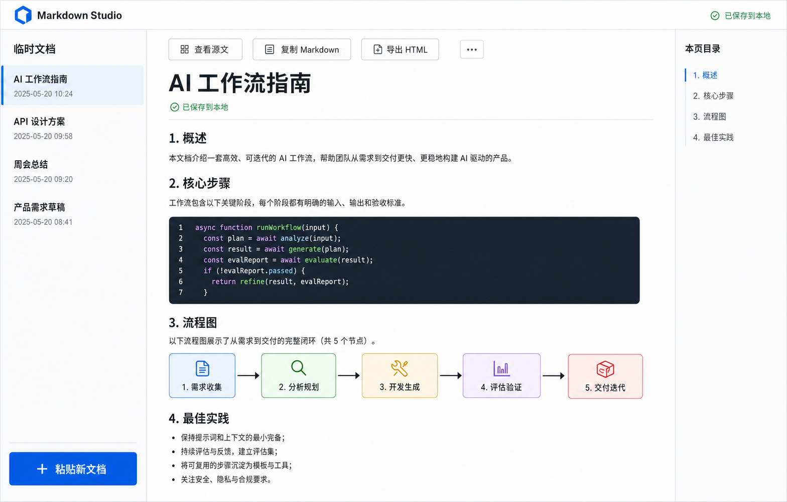
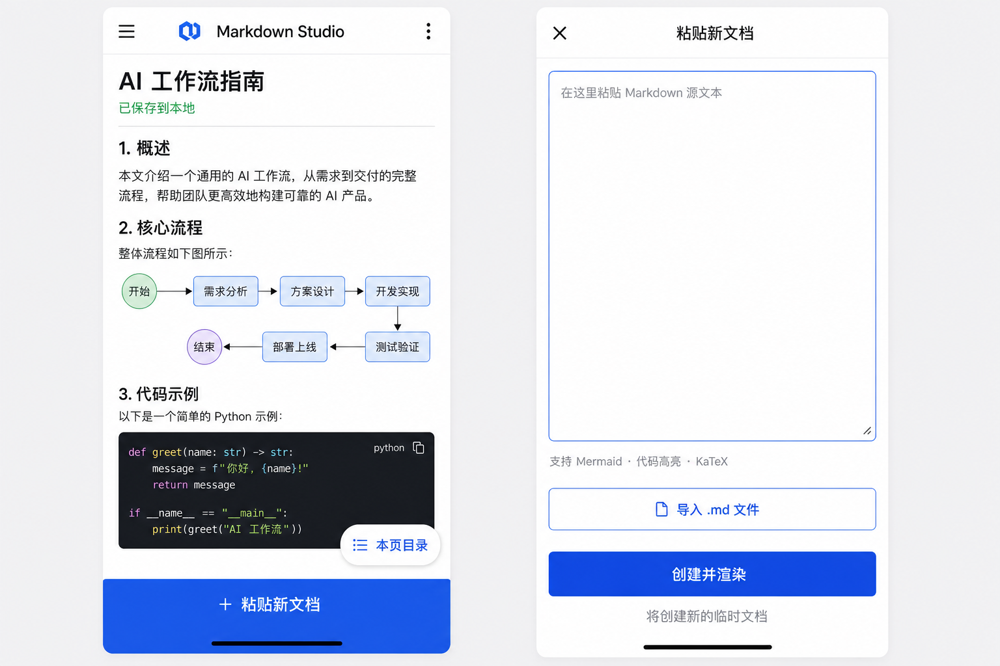
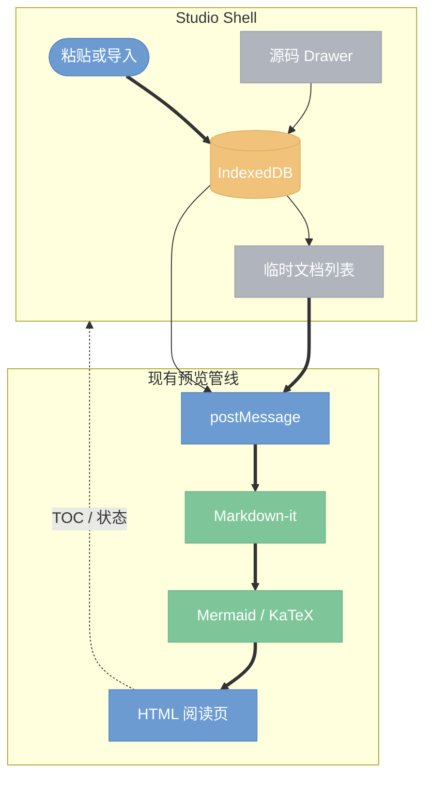

# Markdown Studio 临时 Markdown 工作台设计

- **日期**：2026-07-15
- **状态**：已被安全静态版规格取代
- **后继规格**：`2026-07-15-markdown-studio-secure-static-design.md`
- **定位**：从 Browser 中独立出来的粘贴式 Markdown 阅读工具

## 1. 目标

Markdown Studio 面向“复制 AI 输出并立即阅读”的场景。用户粘贴 Markdown 源文本后，系统创建一份新的临时文档，立即使用现有 Markdown 预览管线渲染 HTML，并在浏览器本地持久化。产品默认提供完整阅读体验，源码编辑只在用户主动打开时出现。

第一版必须满足：

- 每次粘贴默认创建新文档，不覆盖当前文档。
- 支持保存和切换多份临时文档。
- 关闭或重启浏览器后，文档仍可恢复。
- 复用现有 Markdown、Mermaid、KaTeX、代码高亮和导出能力。
- 桌面端以阅读区为主，移动端使用单栏阅读。
- 不依赖账号、远端数据库或外部 Markdown 服务。
- 作为独立 `mkdp studio` 功能运行，不要求先进入 Browser。

## 2. 非目标

- 不做文件夹、目录树、工作区同步或 Git 集成。
- 不做多人协作、登录、云同步和分享权限。
- 不引入 CodeMirror、Monaco 等完整代码编辑器。
- 不把源码编辑器长期固定在阅读区旁边。
- 不在第一版实现跨浏览器同步、全文搜索或版本历史。
- 不重写现有 Markdown 渲染器。

## 3. 已确认的产品决策

| 维度 | 决策 |
| --- | --- |
| 核心动作 | 粘贴 Markdown 后创建新临时文档 |
| 默认界面 | 渲染后的阅读视图 |
| 多文档 | 左侧平铺临时记录，不使用目录树 |
| 源码修改 | 按需打开源码 Sheet/Drawer |
| 持久化 | 浏览器 IndexedDB，本地保存 |
| 标题 | 优先取第一个 H1，否则取首个非空行，最后使用“未命名文档 N” |
| Mermaid | 自动渲染；支持溢出滚动、放大查看和错误回退 |
| 桌面布局 | 临时文档栏 + 阅读区 + 本页目录 |
| 移动布局 | 单栏阅读；文档列表、TOC 和源码均使用 Sheet |
| 独立入口 | `mkdp studio` 启动，主路由 `/_mkdp/studio` |
| 兼容入口 | 原 `/_mkdp/scratch` 保留为 Studio 别名或重定向 |

## 4. 视觉设计

### 4.1 桌面端



- 顶栏仅保留品牌、全局状态和少量工具，避免 Dashboard 感。
- 左侧“临时文档”按最近更新时间排列，显示标题和时间；不出现文件夹图标或层级。
- 阅读区使用冷白背景、石墨文字、钴蓝强调色和克制的分隔线。
- 右侧 TOC 只反映当前文档标题，跟随滚动高亮。
- “查看源文”“复制 Markdown”“导出 HTML”是当前文档工具。
- “粘贴新文档”是左侧底部唯一主操作。

### 4.2 移动端



- 默认是单栏阅读，不缩放桌面三栏布局。
- 顶部菜单打开临时文档 Sheet；“本页目录”打开 TOC Sheet。
- 底部固定“粘贴新文档”，遵守安全区并提供至少 44px 点击高度。
- 新文档使用全屏 Sheet，包含大面积原生 `textarea`、`.md` 导入和“创建并渲染”。
- 源文编辑也使用全屏 Sheet，保存后返回原阅读位置。

设计稿中的文字和控件最终全部由 HTML/CSS 实现；图片只作为视觉基准，不会作为界面截图嵌入产品。

### 4.3 视觉系统校准

实现使用以下固定 token，不在编码阶段临时派生另一套色板：

| Token | 值 | 用途 |
| --- | --- | --- |
| Canvas | `#F6F8FB` | 应用背景 |
| Paper | `#FFFFFF` | 正文阅读面 |
| Ink | `#171A21` | 主文字 |
| Muted | `#697386` | 时间、说明和次级状态 |
| Rule | `#DDE3EC` | 栏位与内容分隔 |
| Render Blue | `#1769E8` | 粘贴、新建、选中和焦点 |
| Saved Green | `#208A55` | 仅用于本地保存成功状态 |

字体按内容角色分工：产品 UI 和正文使用 `system-ui, "PingFang SC", "Microsoft YaHei", sans-serif`；代码、时间和快捷键使用 `SFMono-Regular, Consolas, monospace`。标题通过字重、字距和留白建立层级，不依赖在线字体。

唯一视觉签名是“渲染线”：当前临时文档左侧显示一条细钴蓝线；创建文档后，这条线从粘贴 Sheet 边缘过渡到阅读区，表达源文本进入渲染结果。其他区域保持克制，不叠加第二套装饰语言。`prefers-reduced-motion` 下取消过渡，只保留最终状态。

## 5. 核心交互

### 5.1 首次打开

没有本地文档时显示空状态：

- 主标题：“粘贴 Markdown，立即阅读”。
- 主操作：“从剪贴板粘贴”。
- 次操作：“导入 .md 文件”。
- 浏览器不允许静默读取剪贴板时，聚焦粘贴区并提示用户按 `Cmd/Ctrl+V`。

### 5.2 创建文档

用户可以通过以下入口创建文档：

1. 在粘贴 Sheet 中粘贴 Markdown。
2. 点击“从剪贴板粘贴”并授权读取剪贴板。
3. 拖放或选择一个 `.md` / `.markdown` 文件。

“创建并渲染”仅在内容包含非空字符时可用。创建成功后关闭 Sheet、选中新文档、持久化，并将 Markdown 通过 `postMessage` 发送给预览 iframe。

### 5.3 切换和管理

- 文档列表按 `updatedAt` 降序排列。
- 切换文档不会修改其他文档。
- 删除需要二次确认；删除当前文档后选中下一份最近文档。
- 用户可重命名，后续源码更新不再自动覆盖手动标题。
- 复制 Markdown 使用 Clipboard API；失败时显示可恢复的提示。

### 5.4 查看和编辑源文

- “查看源文”在桌面端打开右侧 Drawer，在移动端打开全屏 Sheet。
- 使用原生等宽字体 `textarea`，不提供复杂编辑器能力。
- 输入后 250ms 防抖：更新 IndexedDB，并向 iframe 推送最新内容。
- 关闭源码界面后恢复进入前的正文滚动位置。

## 6. 架构与数据流



实现继续使用同源 iframe 隔离渲染页面。Studio Shell 管理文档、导航和响应式交互；现有 `app/pages/index.jsx` 继续负责 Markdown 渲染。二者通过已有 `mkdp:set-content`、主题、导出和 TOC 消息通信，避免出现第二套渲染行为。

### 6.1 模块边界

| 模块 | 职责 |
| --- | --- |
| `markdown-studio-shell.js` | 生成 Studio HTML shell，承载布局、交互和 IndexedDB 客户端逻辑 |
| `standalone-preview-server.js` | 暴露 Studio 路由和预览资源，不管理文档内容 |
| `standalone-preview-runtime.js` | 创建无 Browser 依赖的 Studio session |
| `mkdp-studio.js` / CLI command | 启动服务、打开 `/_mkdp/studio`、处理退出 |
| `app/pages/index.jsx` | 复用现有 Markdown/Mermaid/KaTeX 渲染和导出 |

### 6.2 IndexedDB 数据模型

数据库名：`mkdp-markdown-studio`，版本：`1`。

`documents` object store：

```js
{
  id: "crypto.randomUUID() or fallback",
  title: "AI 工作流指南",
  titleMode: "auto" | "manual",
  markdown: "# AI 工作流指南\n...",
  createdAt: 1784073600000,
  updatedAt: 1784073600000
}
```

`preferences` object store 保存 `activeDocumentId`、主题和界面偏好。IndexedDB 不可用时回退到内存模式，并明确提示“仅当前会话保存”；不静默假装持久化成功。

## 7. Mermaid 体验

- 延续现有 fenced `mermaid` 识别与主题配置。
- 桌面端宽图在正文宽度内适配；无法等比缩小时允许横向滚动。
- 移动端 Mermaid 容器支持横向滚动，保持节点文字可读。
- 点击图表打开全屏查看层，提供放大、缩小、适应屏幕、关闭。
- Mermaid 语法错误时保留原始代码，并显示简短错误信息，不能阻断整篇文档。
- 明暗主题变化后重新渲染 Mermaid，避免图中文字或连线失去对比度。

## 8. 响应式规则

| 视口 | 布局 |
| --- | --- |
| `>= 1180px` | 260px 文档栏 + 弹性阅读区 + 220px TOC |
| `768–1179px` | 文档栏收为 Drawer，阅读区 + 220px TOC |
| `< 768px` | 单栏阅读；文档、TOC、源码全部为 Sheet |

阅读正文最大宽度约 860px。代码块和表格允许局部横向滚动，页面本身不得出现意外横向滚动。

## 9. 错误与边界处理

- 空内容：不创建文档，并把焦点留在粘贴区。
- 超大内容：创建前检查 UTF-8 估算大小；单份超过 2 MiB 时提示确认，不直接拒绝。
- 存储配额不足：保留当前内存内容，提示用户复制 Markdown 后清理旧文档。
- Clipboard API 被拒绝：回退到手动粘贴，不把权限错误显示为系统故障。
- 非 UTF-8 文件：显示导入失败，不创建乱码文档。
- iframe 未就绪：只缓存最新一次待渲染内容，在 `load` 后发送。
- 快速切换：使用递增 render token，旧文档的迟到状态不得覆盖当前文档 UI。
- 删除最后一份文档：返回空状态。

## 10. 安全与隐私

- 文档只存储在当前浏览器 IndexedDB，不上传网络。
- UI 明确显示“已保存到本地”，不使用“已同步”等误导性文案。
- `postMessage` 接收端校验 `event.origin === location.origin`，发送端使用明确 origin，不继续使用通配符 `*`。
- 复用现有 Markdown 渲染安全边界；不新增任意脚本执行能力。
- 导入只读取用户明确选择或拖放的文本文件。

## 11. 可访问性

- 所有图标按钮都有可见 tooltip 和 `aria-label`。
- Drawer、Sheet 和删除确认框使用正确的 dialog 语义、焦点圈定和 Escape 关闭。
- 键盘可完成新建、切换、编辑、复制和关闭。
- 焦点样式不只依赖颜色；正文与控件达到 WCAG AA 对比度。
- 遵守 `prefers-reduced-motion`，Sheet 动画关闭后不影响状态变化。

## 12. 测试与验收

### 12.1 单元和路由测试

- Studio shell 包含所需 landmark、dialog、iframe 和持久化入口。
- `/_mkdp/studio` 在未启用 `browseRoot` 时返回 200。
- `/_mkdp/scratch` 仍可访问并进入 Studio。
- 标题提取覆盖 H1、首行和空标题回退。
- CLI 帮助包含 `mkdp studio`，命令可启动并退出。

### 12.2 Playwright 核心路径

1. 空状态粘贴第一份 Markdown，验证标题、正文和 Mermaid SVG。
2. 再创建第二份，验证第一份未被覆盖且可切换恢复。
3. 刷新页面，验证两份文档和当前选中项从 IndexedDB 恢复。
4. 打开源文修改内容，验证防抖保存与实时渲染。
5. 删除当前文档，验证选中回退和最后一份删除后的空状态。
6. 验证复制 Markdown、导出 HTML、主题切换和 TOC 跳转。
7. 在 390px 视口验证单栏、Sheet、底部安全区和无页面横向溢出。

### 12.3 视觉验收

- 桌面端与 `desktop-concept.png` 对照布局、密度、色彩和排版。
- 移动端与 `mobile-concept.png` 对照阅读态和粘贴态。
- 明暗主题均检查正文、代码块、Mermaid、分隔线和交互状态。
- 不出现目录树、常驻源码分栏、Dashboard 卡片或未实现的假控件。

## 13. 兼容与发布

- Browser 的文件浏览行为保持不变；其原 Scratch 入口指向新的 Studio。
- 根仓库脚本和发布 CLI 包都提供 `studio` 命令。
- CLI 包继续携带现有 web/static 资源，不新增远端 CDN 依赖。
- 第一版仍由本地 Node 服务提供预览资源；后续如需公开托管，再单独设计纯静态部署模式和内容安全策略。
