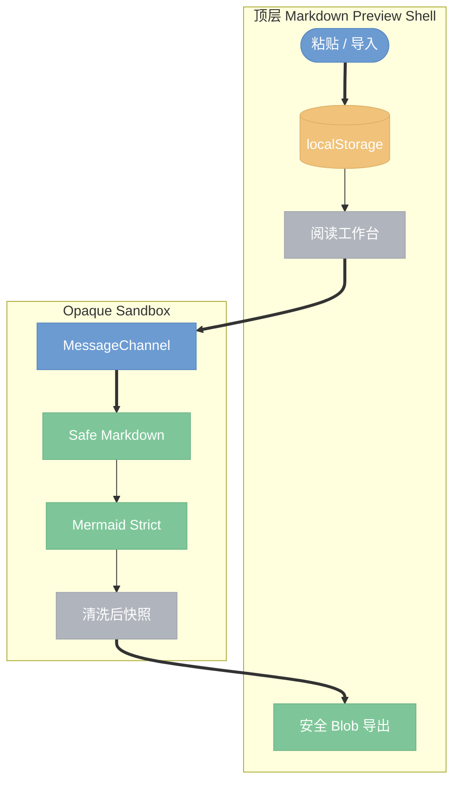

# Markdown Preview 安全静态版设计

- **日期**：2026-07-15
- **状态**：已确认，待实现
- **取代**：`2026-07-15-markdown-studio-design.md`

> **命名说明（2026-07-15）**：用户可见产品名改为 **Markdown Preview**，主 CLI 入口改为 `mkdp paste`。`mkdp studio` 暂时作为隐藏兼容别名；内部 `studio` 路径、`mkdp-studio:*` 存储 key 与 `mkdp:studio-init` 协议名暂不迁移。

## 1. 目标与威胁模型

Markdown Preview 是一个粘贴优先的临时 Markdown 阅读工作台。用户每次粘贴默认创建一份新文档，文档只保存在访问者浏览器中，默认界面展示渲染结果，源码编辑按需打开。

产品必须同时适用于：

- 本地 `mkdp paste`。
- HTTPS 内网静态站。
- HTTPS 公网静态站或 CDN。

所有粘贴、剪贴板和导入的 Markdown 都视为不可信输入。内网不视为可信网络。攻击者可能构造 HTML、SVG、Mermaid directive、危险 URL、超大文本或伪造消息，目标可能是读取其他临时文档、访问本机/内网资源、执行脚本或阻塞浏览器。

## 2. 决定性架构



Markdown Preview 是独立静态应用，不运行现有 Preview Server、Socket.IO、Browse API、本地图片路由或导出 proxy。顶层 Shell 管理 UI 与 `localStorage`；不可信 Markdown 只在没有 `allow-same-origin` 的 sandbox iframe 中渲染。

iframe 固定为：

```html
<iframe
  src="./studio-preview.html"
  sandbox="allow-scripts"
  referrerpolicy="no-referrer"
  title="Markdown 阅读视图"
></iframe>
```

不得添加 `allow-same-origin`、`allow-downloads`、`allow-forms`、`allow-popups` 或 top-navigation 权限。子帧不能读取父页面 DOM、`localStorage` 或 Clipboard。

## 3. 交付形态

### 3.1 静态制品

`studio/dist/` 可直接部署到 Nginx、对象存储、GitHub Pages 或 CDN。它只包含静态 HTML、CSS、JS、字体和图标，不包含 API。

### 3.2 本地 CLI

`mkdp paste` 使用最小静态文件服务器提供相同的 `studio/dist/`：

- 默认只绑定 `127.0.0.1:17329`。
- 支持 `--port <number>`。
- 端口占用时明确失败，不回退到随机端口。
- 使用每次启动生成的 capability path token；token 改变不影响 origin，因此不影响 `localStorage`。
- 校验 Host，只服务静态 Markdown Preview 文件。

现有 Browser、Preview、Scratch 保持原行为，仅作为本地工具；不得被反向代理到内网或公网。

## 4. 本地存储

第一版使用 `localStorage`，不使用 IndexedDB。

| Key | 内容 |
| --- | --- |
| `mkdp-studio:index:v1` | 文档 metadata、排序、当前文档 ID、schema version |
| `mkdp-studio:document:<id>` | 单份 Markdown 源文本 |
| `mkdp-studio:preferences:v1` | 主题和界面偏好 |

约束：

- 最多 50 份文档。
- 单份 UTF-8 文本硬限制 1 MiB。
- 总序列化大小软限制 4 MiB。
- 写入捕获 `QuotaExceededError`；失败时不得显示“已保存到本地”。
- `storage` 事件检测其他标签页更新；第一版不做冲突合并，若当前源文正在编辑则提示重新载入或保留当前副本。
- 清除站点数据会删除文档；UI 和文档必须明确说明。
- 公网部署使用专用 origin，不与其他业务应用共享 origin。

## 5. 安全渲染器

Markdown Preview 新建独立的 safe preview entry，不复用旧 `PreviewPage` 的 socket 生命周期和完整插件链。

### 5.1 白名单能力

- Markdown core，`html:false`。
- CommonMark 表格、列表、引用、链接、任务列表等纯 Markdown 能力。
- 经过转义的代码高亮。
- KaTeX，固定 `trust:false`，限制单表达式长度。
- Mermaid 11.x，固定 strict 配置。
- TOC 提取和 active heading 上报。

### 5.2 第一版禁用

- 原始 HTML。
- 旧 `image.js`。
- PlantUML。
- sequence-diagrams。
- flowchart.js。
- dot/Graphviz。
- Chart.js fenced plugin。
- 本地绝对/相对图片路径。
- 远程图片、字体和媒体自动加载。
- `data:image/svg+xml`。
- 用户覆盖 Mermaid 安全配置。

允许的链接 scheme：`https:`、`http:`、`mailto:`、`tel:` 和页内 `#`。拒绝 `javascript:`、`vbscript:`、`file:` 和其他危险 scheme。

图片第一版只允许受控的 `data:image/png|jpeg|gif|webp`；其余图片显示为可读占位信息。以后如加入远程图片，必须由用户显式触发并说明隐私影响。

### 5.3 两阶段清洗

- Markdown HTML 插入 iframe 前用 DOMPurify 3.x HTML allowlist 清洗。
- Mermaid SVG 生成后用单独 SVG allowlist 清洗，禁止 `foreignObject`、事件属性、脚本和外部资源。
- 顶层 Shell 不接收或插入未清洗 HTML；标题、TOC、错误均使用 text node。

Mermaid 固定配置至少包含：

```js
{
  securityLevel: 'strict',
  htmlLabels: false,
  startOnLoad: false,
  maxTextSize: 50000,
  maxEdges: 500
}
```

单文档最多渲染 20 个 Mermaid 图，单图源码最多 50 KiB；超限或语法错误时显示原始代码和可访问错误提示。

## 6. 私有消息协议

opaque sandbox 的消息 origin 为 `"null"`，不能使用同源 origin 判断。

初始化流程：

1. iframe `load` 后，父页面确认目标是自己的 `iframe.contentWindow`。
2. 父页面创建 `MessageChannel` 和一次性随机 token。
3. 父页面仅向该 `contentWindow` 发送 `mkdp:studio-init`，并 transfer `port2`。
4. 子帧只接受来自 `window.parent` 的一次初始化，随后移除全局 message listener。
5. 后续所有消息仅走私有 `port1/port2`，包含 token、协议版本、严格 type 和大小限制。

核心消息：

- `render`：`documentId`、`renderId`、Markdown、主题。
- `rendered`：`renderId`、TOC、是否含 Mermaid、错误摘要。
- `active-heading`：`renderId`、heading ID。
- `scroll-to`：`renderId`、heading ID。
- `snapshot-request` / `snapshot-result`：无脚本导出快照。

Shell 忽略旧 `renderId`、错误 token、未知 type、超限 payload 和来自其他 source/channel 的消息。

## 7. 导出

导出由父页面创建 Blob 并下载。iframe 不获得下载权限。

导出文件必须：

- 不含 `<script>`、事件属性和 viewer script。
- 不含 `iframe`、`object`、`embed`、`form`、`foreignObject`。
- 不调用服务端 proxy，不抓取或内联远程资源。
- 使用本地固定 CSS。
- Mermaid 使用再次清洗后的 inline SVG；若无法安全清洗则退回源码块。
- 重新打开导出文件时，攻击样例不能执行。

## 8. UI 与视觉

桌面端、移动端交互和视觉继续以已确认设计稿为准：

- [桌面端设计稿](../assets/markdown-studio/desktop-concept.png)
- [移动端设计稿](../assets/markdown-studio/mobile-concept.png)

固定 token：Canvas `#F6F8FB`、Paper `#FFFFFF`、Ink `#171A21`、Muted `#697386`、Rule `#DDE3EC`、Render Blue `#1769E8`、Saved Green `#208A55`。

保留“渲染线”视觉签名。移动端使用单栏阅读、文档 Sheet、TOC Sheet、源码 Sheet 和底部固定“粘贴新文档”。所有 Sheet 必须支持焦点圈定、Escape、backdrop、关闭后焦点恢复和安全区。

## 9. CSP 与部署头

Shell 推荐：

```text
default-src 'none';
script-src 'self';
style-src 'self';
img-src 'self' data: blob:;
font-src 'self' data:;
frame-src 'self';
connect-src 'none';
object-src 'none';
base-uri 'none';
form-action 'none';
frame-ancestors 'none';
```

Preview 可为 Mermaid/KaTeX 单独允许 `style-src 'self' 'unsafe-inline'`，不得放宽 `script-src`。Preview `frame-ancestors 'self'`。

共同响应头：

- `X-Content-Type-Options: nosniff`
- `Referrer-Policy: no-referrer`
- `Permissions-Policy: camera=(), microphone=(), geolocation=()`
- 公网 HTTPS 加 HSTS。

JS/CSS 外置，不在 HTML 中放大型内联脚本。静态部署不开 CORS，也没有 CSRF 或认证型 API。

## 10. 测试门禁

### 功能

- 创建、切换、编辑、删除多份临时文档。
- 刷新和重启本地服务后恢复。
- localStorage 数量、单文档和配额错误。
- Mermaid 成功、失败、超限和快速切换。
- 桌面、平板和 390px 移动端交互。
- 静态部署路径和本地 CLI 固定端口。

### 安全

- raw HTML、事件属性、SVG、`foreignObject` 不执行。
- image alt/title 注入不执行。
- 危险 URL 和 `data:image/svg+xml` 被拒绝。
- Mermaid directive、click/link/html label 不能覆盖 strict 配置。
- KaTeX trust 命令无效。
- forged message、错误 source、错误 token、旧 renderId 被忽略。
- preview 无法访问父页面 DOM 和 `localStorage`。
- 导出的 HTML 无脚本并通过重新打开攻击测试。
- `/_local_image_`、`/_mkdp_export_proxy`、`/_mkdp/browse`、`/socket.io` 在静态制品和本地 Markdown Preview 服务器均为 404。
- 超大 Markdown 和 Mermaid 被拒绝，不进入渲染。

### 视觉和无障碍

- 对照设计稿检查桌面 `1536x1024` 和移动 `390x844`。
- 键盘完成新建、切换、源码编辑、TOC 和关闭。
- focus trap、焦点恢复、reduced motion、明暗主题和无横向页面溢出。

## 11. 发布边界

- 当前动态 Preview/Browser Server 永远不作为 Markdown Preview 的内网或公网运行时。
- Markdown Preview 使用独立现代依赖和 lockfile；构建时执行依赖审计。
- 公网发布前必须升级并审计 Markdown、Mermaid、KaTeX、DOMPurify 和构建工具。
- 若以后增加远程图片、分享、上传、同步或服务端导出，必须重新进行威胁建模和安全审查。
