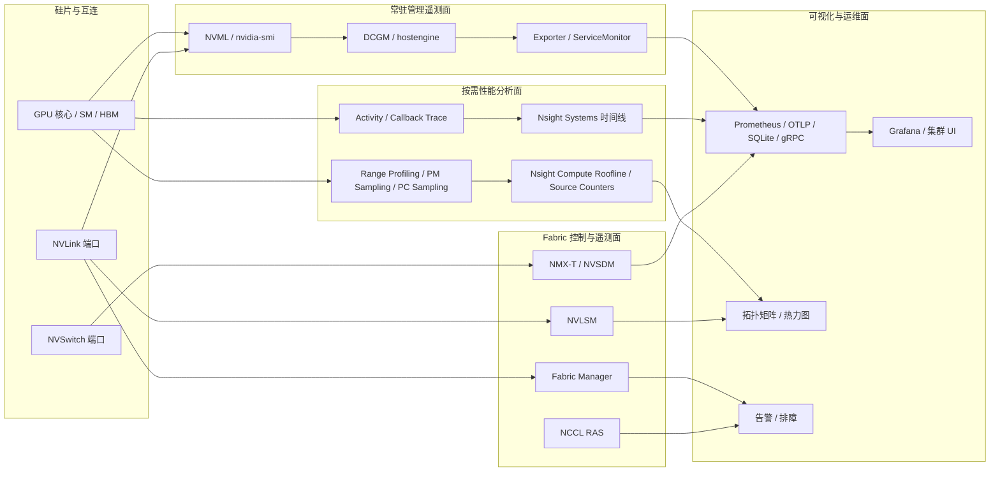

# 英伟达 GPU / NVLink 可观测性与可视化体系深度技术分析

日期：2026-04-01  
研究目标：拆解英伟达在 `GPU / NVLink / NVSwitch` 上的可观测性、性能分析与可视化体系，并提炼出一套可供自研 GPU 参考的分层架构、指标体系、接口形态与演进路径

## 执行摘要

英伟达在 GPU 与 NVLink 领域并没有把“可观测性”做成单一产品，而是拆成四个协同层：第一层是以 `NVML`、`nvidia-smi` 和 `DCGM` 为核心的常驻管理遥测面，覆盖设备枚举、功耗、温度、时钟、错误、进程/作业统计以及部分低开销性能计数；第二层是以 `CUPTI`、`Nsight Systems`、`Nsight Compute` 为核心的追踪与性能分析面，负责内核级、区间级和时间线级剖析；第三层是以 `Fabric Manager`、`NVLSM`、`NMX-T`、`NVSDM` 为核心的 NVLink / NVSwitch Fabric 面，负责端口映射、路由、拓扑发现、链路错误与交换机遥测；第四层才是面向运维和开发者的可视化面，包括 `Grafana` 仪表盘、`nvidia-smi topo` 矩阵、`Nsight` 时间线与 roofline、以及 `NCCL RAS` 这类文本化诊断接口。[1][2][4][6][7][8][9][11][12][13][14]

这套体系最值得自研 GPU 借鉴的，不是某一个工具，而是几个结构性原则。第一，英伟达严格区分“常驻低扰动监控”和“按需高精度剖析”，避免把高开销 profiling 能力错误地下放到生产时序监控路径；第二，把拓扑与实体模型做成一等公民，链路、端口、交换机、分区、实例都能被显式建模；第三，把导出协议做开放化，Prometheus、OTLP、SQLite、gRPC、文本 socket 都能承接不同粒度的数据消费者；第四，承认硬件计数器有并发与复用限制，因此在中间层里显式处理多路复用、采样间隔、空值和权限边界，而不是把这些复杂度泄露给最终用户。[2][3][6][7][11][12][14]

对自研 GPU 而言，最核心的结论是：必须至少构建三条数据面和一条控制面。三条数据面分别是“设备健康与资源利用”的 always-on 遥测、“内核/指令/范围”的 on-demand profiling、“链路/交换机/集体通信”的 fabric 遥测；控制面则负责拓扑、分区、故障降级和权限编排。若把这四个面混成一个单体 agent 或一个单一 API，后续一定会在开销、权限、扩展性和可视化上同时失控。[2][8][9][12][14]

## 研究范围与方法

本文只使用英伟达一手资料，覆盖 `CUPTI`、`DCGM`、`NVML`、`Nsight Systems`、`Nsight Compute`、`Fabric Manager`、`MNNVL`、`NCCL RAS`、`NVSDM`、`NMX-T`、`GPU Operator` 和英伟达企业可观测性参考架构，检索日期为 2026-04-01。[1][2][3][4][5][6][7][8][9][10][11][12][13][14][15][16]

本文不试图复述 CUDA 编程模型，也不展开讨论英伟达未公开的内部监控基础设施；分析重点是外部可见的 API、守护进程、导出协议、可视化形态、故障处理语义，以及这些设计对“自研 GPU 需要怎样建模与分层”所产生的直接启发。[1][2][8][12]

## 主体分析

### 一、英伟达可观测性体系的总体拆分

如果把英伟达的体系抽象成架构图，它本质上不是“一个监控系统”，而是“多个观测平面共享同一个实体图谱”。设备平面围绕 GPU、MIG instance、作业和进程；fabric 平面围绕 GPU 端口、NVLink、NVSwitch、分区与路由；profiling 平面围绕 kernel、range、source line、warp stall 和时间戳；运维平面则围绕节点、集群、命名空间、Pod、Slurm 作业和仪表盘。[2][3][6][7][8][9][12]

这个图里最关键的一点是，英伟达没有把 `NVML/DCGM` 与 `CUPTI/Nsight` 混在一起。`DCGM` 明确把 profiling metrics 定位成“低性能开销、连续采集”的设备级硬件计数能力，但同时又清楚说明它与 `Nsight Systems`、`Nsight Compute` 这类开发工具会因为硬件限制而冲突，必要时要 `pause/resume`；这意味着英伟达内部对“生产观测”和“开发剖析”的边界是清醒而严格的。[2]

### 二、常驻管理遥测面：NVML、DCGM 与导出器

#### 2.1 NVML 是底层设备可观测接口，不是完整平台

`NVML` 本质上是设备管理与状态查询 API，而不是集群级观测系统。对于 NVLink，`NVML` 直接提供 `nvmlDeviceGetNvLinkUtilizationCounter()` 读取指定 link 上的接收与发送计数，并提供复位错误计数、复位利用率计数等接口；这说明在英伟达设计里，“链路计数器”从一开始就是设备级实体的一部分，而不是仅存在于 fabric 控制器里。[4]

更重要的是，`NVML` 在较新的 `GPM` 枚举里已经把 GPU 指标扩展为统一的“性能指标目录”，既包含 `PCIE_TX_PER_SEC`、`PCIE_RX_PER_SEC`，也包含每条 NVLink 的 `NVLINK_Lx_RX_PER_SEC` / `TX_PER_SEC`，甚至还包含 `C2C_TOTAL_TX_PER_SEC`、`C2C_TOTAL_RX_PER_SEC` 以及自启动以来累计字节计数；这说明英伟达正在把“设备管理 API”和“轻量性能监控 API”进一步收敛，让一部分 profiling 价值下沉到 management plane。[5]

对自研 GPU 的启发很明确：需要一个类似 `NVML` 的稳定底层 ABI，直接暴露设备、子设备、链路和基础计数器，但不要在这一层塞入作业编排、集群指标聚合和重型 profiling 逻辑。底层设备 API 的职责应该是“把硬件状态稳定、低歧义地抬到软件栈”，而不是“替代上层观测系统”。[4][5]

#### 2.2 DCGM 的真正价值在于“中间层聚合守护进程”

`DCGM` 的设计价值并不只在于多暴露了几个指标，而在于它把英伟达原本分散在驱动、NVML 和硬件计数器里的能力，统一到一个长期运行的 `hostengine`/API 中间层。官方文档显示，`DCGM` 既提供作业统计、进程统计、健康检查、拓扑、NVLink counters、字段组，也说明这些能力都可以从 C、Python、Go API 访问，而不仅仅是 CLI。[2]

`DCGM` 的“字段组”思路尤其值得借鉴。它允许用户预定义一组 fields，对一组 GPU 持续 watch，然后获取 latest 或 range values；官方文档明确把 job statistics、process statistics 和 health 都当成预定义字段组的一部分。[2] 这其实等价于在监控中台里显式定义“指标命名空间 + 采样计划 + 实体范围”的组合对象。对自研 GPU 来说，这比只提供海量零散指标更重要，因为它决定了后续 exporter、告警和仪表盘的组织方式。[2]

在性能指标侧，`DCGM` 把 profiling module 做成了生产可用能力，并明确说明默认采样频率为 `1Hz`，最小可配置频率为 `100ms`；同时它也坦白指出，由于 GPU 硬件限制，不是所有 metrics 都能同时采集，某些指标需要多次 pass，因此 `DCGM` 内部提供自动 multiplexing，以统计采样方式对请求指标分组采集。[2] 这段说明非常关键，因为它揭示了一个常被忽视的现实：硬件计数器调度器本身就是 observability 系统的一部分。

官方还进一步指出，`DCGM` profiling metrics 与 `Nsight Systems`、`Nsight Compute` 等工具存在资源冲突，使用其他 profiling tool 时建议先暂停 `DCGM` 指标采集；并且自 Linux driver 418.43 起，采集 profiling counters 需要管理员权限，`nv-hostengine` 也要以超级用户权限运行。[2] 这意味着自研 GPU 若要提供连续性能计数能力，必须同时设计好：

- 计数器冲突仲裁器
- 多 pass / multiplexing 语义
- 空值与降采样策略
- 特权守护进程与普通用户 API 的隔离

#### 2.3 DCGM 把设备指标真正接入运维系统

`dcgm-exporter` 进一步把 `DCGM` 转成 Prometheus 语义。官方文档直接说明，在 Kubernetes 场景下推荐用 `dcgm-exporter` 收集 GPU telemetry，它基于 `DCGM` 暴露 Prometheus 可抓取格式，并且利用 `KubeletPodResources` API 做 GPU 到 Pod 的映射，同时自带 `ServiceMonitor` 暴露 endpoint。[3]

这不是简单的“格式转换”，而是可观测性系统真正产品化的关键一步。因为运维可视化要回答的并不是“GPU 0 温度是多少”，而是“哪个 Pod、哪个租户、哪个 namespace、哪个节点上的哪个 GPU instance 出现了什么异常”。官方文档同时说明 `dcgm-exporter` 能区分 `MIG` 模式下的 GPU instance 级别监控，并且在 `MIG` 启用时默认优先监控实例而不是整卡。[3] 这说明英伟达在生产观测里已经把“可分区 GPU 实体”作为一等对象，而不是把实例数据塞回整卡维度。

### 三、性能分析与追踪面：CUPTI、Nsight Systems、Nsight Compute

#### 3.1 CUPTI 的核心是把追踪和性能分析分开

`CUPTI` 文档对自身的划分非常清楚。`Activity API` 用于异步记录 CUDA 活动，例如 CUDA API、kernel、memory copy；`Callback API` 用于订阅 CUDA 事件；`Range Profiling API` 和 `Host Profiling API` 用于对特定执行范围采集性能指标；`PC Sampling API` 用于采样 warp program counter 和 scheduler state 以揭示 stall reasons；`PM Sampling API` 则定期采样 GPU 性能监视器。[1]

更值得注意的是，`CUPTI` 在 CUDA 13.0 中已经把传统 `Profiling API` 标记为 deprecated，并明确推荐使用 `Range Profiling API`。[1] 这意味着英伟达对 profiling 模型的演进方向很明确：不是“对整个程序无边界地收集指标”，而是“把 profile 绑定到明确的 range / kernel 集合 / code region”。这对于自研 GPU 很重要，因为一旦 profiling 接口没有“range”这一层，后续很难实现低扰动采集、用户态注解和跨层关联。

`CUPTI` 文档还明确指出，profiling 往往需要 replay kernel 甚至 replay full application，才能在受控条件下收集完整指标；同时 PC Sampling 和 PM Sampling 分别承担“停顿原因可解释性”和“时间序列性能监测”的职责。[1] 也就是说，英伟达把“为什么慢”拆成两类机制：一类是基于静态/分范围聚合的计数器，另一类是基于时间或 PC 的采样。自研 GPU 若只做前者，最终会缺少时间维度；若只做后者，又会缺少精确定量。

#### 3.2 Nsight Systems 是跨栈时间线系统，不只是 GPU 性能分析器

`Nsight Systems` 的价值，不在于它比 CLI 多了图形界面，而在于它把系统级时间线和 GPU 计数串到一起。官方文档显示，它不仅能显示 GPU metrics，包括 `NVLink bytes received`、`NVLink bytes transmitted` 等指标，还支持把 `.nsys-rep` 导出为 `SQLite`，并允许用户用 SQL 直接访问 `GPU_METRICS` 表中的数据。[6]

这一点对自研 GPU 特别重要。很多芯片团队会把 tracing 系统做成封闭二进制格式，只能在自家 viewer 中使用；而 `Nsight Systems` 的 `sqlite export` 证明，一个成功的 profiling/tracing 产品不应只提供 GUI，还要提供机器可消费的中间存储格式，让用户能在自己的报表、脚本和平台里复用这些数据。[6]

从可视化角度看，`Nsight Systems` 的方法是“时间线优先”。它把 CPU、CUDA API、kernel、memory copy、NVTX 范围、GPU metrics 放到统一时间轴上，再允许用户跳转到更深入的 kernel profiler。这个策略的核心不是把所有内容都可视化，而是先把“何时发生”这条主线建立起来，再让用户对热点区域进行 drill-down。[6]

#### 3.3 Nsight Compute 把 kernel 分析做成了“解释型可视化”

`Nsight Compute` 的重点是内核级解释。官方 profiling guide 直接说明它的 `SourceCounters` 包括分支效率和 sampled warp stall reasons，`Warp State Statistics` 用图表展示 warps 在不同状态上花费的 cycles，而 `Roofline` 则用 arithmetic intensity、memory bandwidth boundary、peak performance boundary、ridge point 和 achieved value 来指导优化。[7]

这套系统的关键，不只是展示指标，而是把指标转成“开发者可操作的解释框架”。例如 roofline 不是简单画两条线，而是明确把 kernel 落点划分为 `memory bound` 或 `compute bound`，并把 achieved value 到 roofline boundary 的距离解释为性能提升空间。[7] `SourceCounters` 与 stall reasons 则把 “某段源码慢” 进一步分解为 barrier、branch resolving、drain、dispatch stall、wait 等具体原因。[7]

`Nsight Compute` 的 `PM Sampling` 也非常有代表性。官方说明它会按固定间隔采样 GPU performance monitors，并把样本与 GPU timestamp 绑定，从而在时间线上展示 workload 行为如何随运行过程变化；同时它也明确指出，只有单 pass 可采集的 metrics 才能进入这一路径，而且受 counter domain 限制。[7] 这再次说明英伟达的设计原则是“先坦白硬件限制，再用工具包裹复杂度”，而不是虚构一个“无限可观测”的假象。

### 四、NVLink / NVSwitch 互连面：从 GPU 端口到交换机控制平面

#### 4.1 GPU 侧的 NVLink 观测是“端口级”，而不是抽象带宽总值

无论是 `NVML` 的 NVLink utilization counter，还是 `GPM` 中每条 link 的 `RX_PER_SEC` / `TX_PER_SEC`，都说明英伟达对 NVLink 的基本建模粒度是“link 端口”，不是“整卡总带宽”。[4][5] `DCGM` 也沿用这种思路，直接提供 NVLink counters 并将错误类型拆成 `CRC FLIT`、`CRC Data`、`Replay Error`、`Recovery Error` 等类别。[2]

这对于自研 GPU 非常重要。很多早期芯片监控系统会把互连指标只做成单卡总量，例如“芯片 A 的链路带宽利用率 72%”，但这种聚合值在排障中几乎没有意义。真正有诊断价值的是“哪一条物理 link、哪一个端口、哪一类错误、是否伴随 replay / recovery、是否与某个拓扑边或路由表项相关”。英伟达把 NVLink 端口做成一等实体，是因为只有这样才能把物理故障、拓扑故障、性能劣化和作业症状关联起来。[2][4][5]

#### 4.2 Fabric Manager / NVLSM / NVOS 把拓扑与路由拉进可观测范围

在新一代 `MNNVL` 文档中，英伟达把软件栈描述得很清楚：`NVOS` 包含 `Fabric Manager (FM)`、`NVLink Subnet Manager (NVLSM)`、`NMX-Controller (NMX-C)`、`NMX-Telemetry (NMX-T)` 和 NVSwitch firmware；其中 `FM` 负责把参与 GPU 组织成单一 memory fabric，并与 GPU driver 协同完成 NVLink 端口映射和路由配置，同时提供 fabric 性能和错误监控；`NVLSM` 负责发现 NVLink 拓扑、给 GPU 与 NVSwitch 端口分配逻辑标识、计算并下发 forwarding table，并监控 fabric 变化；`NMX-T` 则负责收集、聚合和发送来自 NVLink switches 的 telemetry data。[9]

这段架构说明的价值极高，因为它证明在 rack-scale GPU 系统里，“拓扑发现”“路由编程”“交换机遥测”“GPU driver 初始化”不是一个组件就能吃下来的事情。也就是说，如果自研 GPU 未来走到多节点或交换结构，不能再把互连监控挂在单卡管理库后面，而要把 fabric 视作独立子系统，至少提供：

- 子网管理器或等价控制器
- 交换机 telemetry agent
- GPU driver 与 fabric manager 的协同初始化路径
- 拓扑与路由配置的审计和可视化接口

#### 4.3 英伟达已经把交换机侧遥测做成标准输出接口

`NMX-T` 官方文档说明，NVL5 网络的 collected data 可通过 `Prometheus` 和 `gRPC metrics` 接口访问，也可以通过 `OTLP` 和 `Prometheus remote write` 流式输出。[14] `MNNVL` 验证文档还给出 `NMX-T` 的 healthcheck 与管理接口，例如 `http://0.0.0.0:9350/healthcheck`、`/management/statistics` 和 `/management/check_status`。[10]

这意味着英伟达在新一代 NVLink 交换网络里，已经把 switch-plane telemetry 明确做成标准协议输出，而不是封装在私有 UI 后面。对于自研 GPU，这是非常直接的参考：只要 fabric 规模上到 rack 级，switch telemetry 就应默认支持 TSDB/OTel 生态，而不是等用户提出需求后再临时拼 exporter。[10][14]

`NVSDM` 则把这一方向进一步前推到 API 层。官方文档说明 `NVSDM` 是面向 Blackwell NVSwitch 系统的监控库，暴露 device health、port counters 和 PCIe statistics，并附带实验性的 `nvsdm_cli` 用于即时诊断。[13] 这说明英伟达已经在交换机侧形成与 `NVML` 类似的“底层监控库 + 工具 + 标准输出”三件套。

#### 4.4 Fabric 观测必须覆盖故障降级语义，而不仅是健康值

`Fabric Manager` 文档非常有价值的一点，在于它不只告诉你“某个对象坏了”，还定义了“坏了之后 fabric 如何降级”。例如在某些 A100 代 NVSwitch 系统中，`ACCESS_LINK_FAILURE_MODE=1`、`TRUNK_LINK_FAILURE_MODE=1` 或 `NVSWITCH_FAILURE_MODE=1` 会让可用带宽下降到 `5/6`；在更保守的模式下，FM 会直接终止初始化，使 CUDA 启动返回 `cudaErrorSystemNotReady`。[8]

这其实触及了一个自研 GPU 常见缺口：很多监控系统只会报“link down”，但不会把“系统实际还能否跑、带宽剩多少、哪些分区被移除、哪些拓扑路径失效”表达出来。英伟达在 FM 里把这些故障模式参数化，说明它把可观测性和控制面策略放在一起设计。[8]

另一个值得注意的点是代际差异。`Fabric Manager` 文档明确指出，`MIG` 启用后 A100 系统会禁用或不使用 GPU NVLinks 并失去 NVLink P2P capability，而 H100 及更新系统在 MIG 模式下会保持 GPU NVLinks active。[8] 这意味着 NVLink 相关指标与行为不能被写成“跨代不变”的静态假设，必须在指标元数据里带上 `sku / generation / mode` 约束。

### 五、作业级与运维级可视化：Grafana、拓扑矩阵与文本化诊断

#### 5.1 英伟达把仪表盘设计成“健康 + 利用率 + 拓扑”的组合

企业可观测性参考架构文档明确说明，GPU Dashboard 同时使用两类来源：`BCM` 提供总览健康指标，`DCGM Exporter` 提供 GPU utilization、thermal health、memory usage 等实时指标；同一套 Dashboard 中同时包含 `GPU Overall Health`、`GPU NVLink Health`、`GPU Power Health`、`GPU Memory Health`、`GPU Temperature`、`GPU Power Usage`、`GPU Utilization`、`Framebuffer Memory Used` 和 `Tensor Core Utilization` 等可视化对象。[12]

这背后的设计逻辑非常值得借鉴。第一，英伟达没有把“健康”与“性能”混成同一种图表，而是显式区分 summary health 和 time-series metrics；第二，`GPU NVLink Health` 被放进总览 Dashboard，说明互连健康被视为一等生产指标，而不是只有开发者才关心的底层细节；第三，`DCGM` 指标过滤和 `BCM` 总览过滤并不完全一致，官方文档还专门提示 Dashboard 顶部过滤只作用于 DCGM metrics 而不作用于 BCM metrics。[12]

较早的 `GPU Operator` 监控文档也体现了同样的产品取向：默认 Grafana 仪表盘围绕 GPU 利用率、显存、温度等运维高频指标组织，而不是围绕开发阶段的细粒度 profiling 指标组织，这说明“先保障生产运维可见性，再引入深度剖析”是英伟达在不同产品层级上反复出现的设计选择。[16]

这说明在多源观测系统里，UI 层必须明确标注数据来源和过滤边界，否则用户会误以为所有卡片都来自同一数据平面。事实上，企业文档还明确指出 `NetQ UI` 与 `Grafana dashboards` 来自不同数据源，前者来自 agent 信息，后者来自 switch OTLP telemetry；因此即使某设备在 UI 里看似健康，Grafana 也可能因为 TSDB 或 OTLP 路径配置问题而缺失数据。[12] 这条经验对自研 GPU 极其重要，因为它本质上是在提醒：UI 不是 source of truth，数据血缘本身必须可观测。

#### 5.2 nvidia-smi 的“拓扑矩阵”依然是高价值可视化

`nvidia-smi` 并不花哨，但它的价值在于“就地、低门槛、第一时间”。官方文档给出 `nvidia-smi nvlink --status` 用于检查每条 NVLink 是否 active、是否达到预期带宽，并给出 `nvidia-smi topo -p2p n` 和 `nvidia-smi topo -m` 用于查看 GPU 间 P2P 与拓扑矩阵。[10][15]

这说明对自研 GPU 来说，CLI 拓扑矩阵不应该被视为“临时调试工具”，而应该被视为正式产品能力。图形 dashboard 适合持续监测和跨节点观察，但在 bring-up、驱动联调和故障定位时，文本矩阵和状态表往往比复杂 UI 更快、更可靠。[10][15]

#### 5.3 NCCL RAS 证明“文本化诊断接口”在分布式场景很有价值

`NCCL RAS` 官方文档指出，该机制通过 plain TCP/IP sockets 工作，`RAS` 轻量且默认开启；其客户端协议是纯文本，甚至可以直接用 `echo verbose status | nc localhost 28028` 查询。[11] 这是一条很容易被忽视、但非常值得借鉴的设计。

分布式训练的许多问题并不需要完整 GUI 才能定位，反而需要一个可以在节点上、容器里、自动化脚本中直接调用的文本接口。`NCCL RAS` 的做法说明，生产级 GPU 软件栈不应只有图形 dashboard，还应提供面向自动化和 SRE 的低依赖查询协议。对自研 GPU 来说，一个类似 `rasctl` 或 localhost socket 的接口，往往比额外做一个大而全 Web 页面更有落地价值。[11]

### 六、英伟达体系中最值得借鉴的设计模式

#### 6.1 设计模式一：把观测系统拆成“常驻”和“按需”两条路径

英伟达没有试图让 `CUPTI`、`Nsight` 一直运行在生产路径上，而是用 `NVML/DCGM` 承担常驻监控，用 `CUPTI/Nsight` 承担开发与深度分析。[1][2][4][6][7] 自研 GPU 如果一开始不这么分层，后续几乎必然遇到三个问题：第一，计数器资源冲突；第二，系统开销无法稳定控制；第三，权限体系失去边界。[2][7]

#### 6.2 设计模式二：把拓扑、端口和实例做成一等实体

英伟达对 NVLink / NVSwitch 的建模粒度覆盖 link、port、switch、partition、MIG instance、fabric domain。[2][3][5][8][9][13] 这意味着监控系统内部必须首先拥有实体图谱，否则任何 dashboard 和告警都只能停留在扁平 key-value 层，最终无法回答“哪条边坏了”“哪个 partition 受影响”“这个 job 究竟跨越了哪些 link”这类核心问题。

#### 6.3 设计模式三：允许多种导出协议并保留原始中间格式

`dcgm-exporter` 走 Prometheus，`NMX-T` 同时支持 Prometheus、gRPC、OTLP 和 remote write，`Nsight Systems` 支持 SQLite 导出，`NCCL RAS` 用文本 socket。[3][6][11][14] 这意味着一个成熟的 GPU 可观测系统不该只输出一种格式。对自研 GPU 而言，至少要同时提供：

- 拉模式时序接口，例如 Prometheus
- 推模式遥测接口，例如 OTLP
- 原始追踪导出格式，例如 SQLite / Parquet
- 低依赖诊断接口，例如本地 socket / CLI

#### 6.4 设计模式四：把“硬件限制”显式产品化

`DCGM` 明说 metrics 不能全部同时采集、需要 multiplexing，`Nsight Compute` 明说 PM sampling 受 counter domain 和 single-pass 限制，`CUPTI` 明说 profiling 可能需要 replay。[1][2][7] 这不是文档层面的“自我辩护”，而是产品层面的真实设计。自研 GPU 如果试图向用户隐藏这些约束，最终只会让观测结果变得不可解释。

## 英伟达体系的局限与隐含代价

#### 7.1 工具链强大，但碎片化明显

从 `NVML`、`DCGM`、`CUPTI`、`Nsight Systems`、`Nsight Compute`、`Fabric Manager`、`NVLSM`、`NMX-T`、`NVSDM` 到 `NCCL RAS`，英伟达的能力覆盖很完整，但入口非常多，职责也随代际演进而变化。[1][2][8][9][13][14] 例如 `Fabric Manager` 文档明确写到，在 DGX H100 / HGX H100 上，FM 不再负责监控和记录 GPU error，而由 NVIDIA driver 继续在 syslog 中监控和记录。[8] 这说明同一类 RAS 责任在不同代次中可能迁移组件。

对自研 GPU 来说，这提醒我们两个风险。第一，不要过早把责任切得过碎，否则后续维护成本会迅速升高；第二，即便拆组件，也必须提供统一入口和统一实体命名，否则使用者会在 API 与工具之间频繁丢上下文。

#### 7.2 生产监控与 profiling 的冲突不是偶发问题，而是结构性问题

`DCGM` 官方明确要求在使用 `Nsight Systems` / `Nsight Compute` 时暂停 profiling metrics 采集。[2] 这说明硬件计数器是稀缺共享资源。对自研 GPU 而言，不能把 counter 资源冲突当成“驱动后续修一下”的实现问题，而应该在架构层引入 profile session manager、counter scheduler 和 capability negotiation。

#### 7.3 代际行为差异会影响上层语义稳定性

`MIG` 对 NVLink P2P 的影响在 A100 与 H100 上不同；`NVSDM` 当前又明确面向 Blackwell NVSwitch 系统。[8][13] 这意味着监控平台中的“指标可用性”“故障语义”“链路状态解释”都必须带上版本化元数据，而不能直接把某代芯片的结论固化成平台事实。

#### 7.4 多源 Dashboard 很强，但容易产生认知分叉

企业 observability guide 已经指出，不同 UI 与 dashboard 可能来自不同数据源，因此设备“看起来健康”与“时序数据缺失”并不矛盾。[12] 这类问题在自研 GPU 体系里也会必然出现，因此必须建设数据血缘、采集链路健康、指标缺失原因和时间同步状态的可视化，否则最终运维团队会把“没有数据”误判为“没有问题”。

## 面向自研 GPU 的参考架构

#### 8.1 建议的分层架构

建议自研 GPU 至少做出下表中的五个核心组件：

| 英伟达对应能力 | 目标职责 | 自研 GPU 建议形态 | 关键要求 |
| --- | --- | --- | --- |
| `NVML` / `nvidia-smi` | 设备、链路、温度、功耗、时钟、错误、库存信息 | `libgpu_mgmt` + `gpu-smi` | 稳定 C ABI；用户态只读查询；端口级实体 |
| `DCGM` / `hostengine` | 聚合 watch、字段组、作业/进程统计、健康检查、连续低开销性能采集 | `gpu-observe-agent` | 支持 field group、采样计划、counter multiplexing、权限隔离 |
| `CUPTI` / `Nsight` | Activity trace、range profiling、PC/PM sampling、source counters | `gpu-profiler-sdk` + `trace/compute viewers` | range 优先；可导出 SQLite/Parquet；支持源码与时间线关联 |
| `Fabric Manager` / `NVLSM` / `NMX-T` / `NVSDM` | 拓扑发现、路由配置、交换机遥测、fabric health | `fabric-manager` + `fabric-telemetry-agent` | 端口/交换机/分区一等建模；Prometheus 与 OTLP 输出 |
| `NCCL RAS` | 分布式作业级快速诊断 | `collective-rasd` | 文本协议、本地 socket、低依赖、可脚本化 |

这五个组件之间不要做强耦合 UI。UI 应该是它们之上的消费者，而不是底座本身。否则一旦 viewer 形态变化，底层 API 会被迫跟着 UI 逻辑扭曲。[1][2][6][11][14]

#### 8.2 建议的指标分层

自研 GPU 的指标不应按“哪个模块顺手上报了什么”来组织，而应按实体和场景组织：

| 指标层 | 实体粒度 | 建议示例 | 采样策略 |
| --- | --- | --- | --- |
| 设备健康层 | chip、HBM stack、board | 温度、功耗、电压、时钟、throttle reason、ECC、retire page | always-on，1s 到 30s |
| 资源利用层 | chip、GPC/SM、copy engine、tensor engine | busy%、occupancy、SM clock、tensor active、framebuffer used | always-on，100ms 到 1s |
| 互连层 | link、port、switch port、route | tx/rx bytes、CRC、replay、recovery、training state、bandwidth mode | always-on，100ms 到 1s |
| 作业归因层 | process、container、job、tenant、instance | GPU time、显存占用、link traffic、错误归属、collective wait | watch on demand + sampling |
| 深度剖析层 | range、kernel、source line、PC | stall reason、instruction mix、roofline、memory latency、PM samples | on-demand，session scoped |
| 控制面层 | partition、fabric domain、switch group | route version、partition state、降级模式、组件心跳、配置版本 | always-on，事件驱动 + 低频轮询 |

这套分层直接对应英伟达现有能力的分布：设备健康与资源利用由 `NVML/DCGM` 主导，作业归因由 `DCGM exporter` 与 orchestration mapping 承接，深度剖析由 `CUPTI/Nsight` 承接，互连与控制面由 `FM/NVLSM/NMX-T/NVSDM` 承接。[2][3][5][7][9][13][14]

#### 8.3 建议的可视化组合

面向自研 GPU，我建议至少建设六类标准视图，而不是只做一个“大盘”：

1. 集群健康总览：节点、整卡、实例、交换机、fabric domain 的红黄绿态，附带数据来源标识。
2. GPU 资源视图：温度、功耗、时钟、利用率、显存、tensor utilization 等时序图。
3. NVLink / NVSwitch 拓扑视图：矩阵图 + 图结构视图，支持按 link/port/route 着色。
4. 作业相关视图：Pod / container / Slurm job / tenant 到 GPU instance 的映射，附带每作业的显存、链路流量、collective 等待时间。
5. 时间线视图：类 `Nsight Systems` 的 CPU-CUDA-kernel-copy-NVTX-GPU metrics 统一时间轴。
6. Kernel 深钻视图：类 `Nsight Compute` 的 roofline、stall reason、source counters 与 baseline diff。

其中第 3、5、6 类视图尤其容易被低估。大多数自研芯片项目能较快做出第 1、2 类大盘，但真正决定开发效率和定位速度的，往往是“拓扑可视化是否一眼看出单边异常”和“时间线/roofline 是否能把问题从现象缩到根因”。[6][7][12][15]

#### 8.4 建议的接口设计

自研 GPU 的接口层建议同时提供四种 northbound 输出：

1. `Mgmt API`：稳定的 C ABI 和 CLI，面向驱动、运维工具与 bring-up。
2. `Observe API`：字段组、watch、range query、事件订阅，面向 exporter、告警和平台。
3. `Profiler API`：activity、range、PC/PM sampling、source-level metrics，面向开发工具。
4. `Fabric API`：switch、port、route、partition、topology、healthcheck，面向控制平面与网络运维。

如果只能优先做一部分，我建议先做 `Mgmt API + Observe API + Fabric health`，同时把 profiler 的数据模型预留出来。原因是没有稳定设备与 fabric 观测面，后续任何 dashboard 都只是临时拼接；但如果 profiler 模型没有尽早定义，等软件生态起来后再重构会非常昂贵。[1][2][8][9]

#### 8.5 建议的演进路线

建议分四阶段实施：

1. 第一阶段，完成整卡与链路的基础可见性：设备状态、link status、错误计数、拓扑矩阵、CLI 诊断。
2. 第二阶段，建设中间层 agent：字段组、作业归因、Prometheus/OTLP 导出、Grafana 总览。
3. 第三阶段，建设 profiling SDK：activity trace、range profiling、PM/PC sampling、SQLite/Parquet 导出。
4. 第四阶段，建设 fabric 控制与可视化：交换机端口遥测、route audit、降级模式可视化、collective RAS。

这个顺序的原因与英伟达体系非常一致：先解决“看得见”，再解决“持续可看”，然后解决“为什么慢”，最后解决“跨节点互连的系统性问题”。如果顺序颠倒，例如先花大量精力做 kernel profiler，而基础设备与链路观测仍不稳定，那么软件团队在 80% 的日常故障中依然会无从下手。[1][2][8][12]

## 结论与综合洞察

英伟达在 GPU / NVLink 上的可观测性体系，本质上是一套分层而不是单体系统。它成功的地方在于：用 `NVML/DCGM` 提供常驻低扰动可见性，用 `CUPTI/Nsight` 提供高精度开发者剖析，用 `FM/NVLSM/NMX-T/NVSDM` 把 fabric 纳入显式控制与监控，用 `Prometheus/OTLP/SQLite/socket` 把数据开放给不同消费者。[1][2][6][8][9][11][14]

对自研 GPU 最有价值的借鉴不是“照着做一个 DCGM”，而是把以下几点提前设计进底座：一是把设备、实例、链路、交换机、分区和作业建成统一实体图谱；二是把 always-on telemetry 与 on-demand profiling 严格分层；三是把计数器冲突、多 pass 和权限问题在平台层解决；四是同时提供 dashboard、拓扑矩阵、时间线和文本化 RAS 四种视角。只要这四点成立，后续工具形态可以演进；如果这四点缺失，再漂亮的 UI 也无法形成真正的可观测性闭环。[2][6][7][8][11][12]

## 参考文献

[1] NVIDIA. (2026). *CUPTI Documentation*. https://docs.nvidia.com/cupti/ (检索日期：2026-04-01)  
[2] NVIDIA. (2026). *DCGM User Guide: Feature Overview*. https://docs.nvidia.com/datacenter/dcgm/latest/user-guide/feature-overview.html (检索日期：2026-04-01)  
[3] NVIDIA. (2026). *DCGM-Exporter*. https://docs.nvidia.com/datacenter/dcgm/latest/gpu-telemetry/dcgm-exporter.html (检索日期：2026-04-01)  
[4] NVIDIA. (2026). *NVML API Reference: NVLink APIs*. https://docs.nvidia.com/deploy/nvml-api/group__NvLink.html (检索日期：2026-04-01)  
[5] NVIDIA. (2026). *NVML API Reference: GPM Enums*. https://docs.nvidia.com/deploy/nvml-api/group__nvmlGpmEnums.html (检索日期：2026-04-01)  
[6] NVIDIA. (2025). *Nsight Systems User Guide 2025.2*. https://docs.nvidia.com/nsight-systems/2025.2/UserGuide/index.html (检索日期：2026-04-01)  
[7] NVIDIA. (2025). *Nsight Compute Profiling Guide 2025.3.1*. https://docs.nvidia.com/nsight-compute/2025.3.1/ProfilingGuide/index.html (检索日期：2026-04-01)  
[8] NVIDIA. (2026). *Fabric Manager User Guide*. https://docs.nvidia.com/datacenter/tesla/fabric-manager-user-guide/index.html (检索日期：2026-04-01)  
[9] NVIDIA. (2026). *MNNVL User Guide: Overview*. https://docs.nvidia.com/multi-node-nvlink-systems/mnnvl-user-guide/overview.html (检索日期：2026-04-01)  
[10] NVIDIA. (2026). *MNNVL User Guide: Verifying*. https://docs.nvidia.com/multi-node-nvlink-systems/mnnvl-user-guide/verifying.html (检索日期：2026-04-01)  
[11] NVIDIA. (2026). *NCCL User Guide: RAS*. https://docs.nvidia.com/deeplearning/nccl/user-guide/docs/troubleshooting/ras.html (检索日期：2026-04-01)  
[12] NVIDIA. (2025). *Enterprise Reference Architectures: Observability Guide*. https://docs.nvidia.com/enterprise-reference-architectures/observability-guide.pdf (检索日期：2026-04-01)  
[13] NVIDIA. (2026). *NVSDM API Reference*. https://docs.nvidia.com/datacenter/tesla/nvsdm/ (检索日期：2026-04-01)  
[14] NVIDIA. (2025). *NMX Telemetry Documentation: Collected Data*. https://docs.nvidia.com/networking/display/nmxtv11/collected%2Bdata (检索日期：2026-04-01)  
[15] NVIDIA. (2026). *DGX BasePOD Deployment Guide: Validate the system topology/NVLink*. https://docs.nvidia.com/dgx-basepod/deployment-guide-dgx-basepod/latest/nvlink.html (检索日期：2026-04-01)  
[16] NVIDIA. (2023). *Enabling the GPU Monitoring Dashboard*. https://docs.nvidia.com/datacenter/cloud-native/gpu-operator/23.6.0/openshift/enable-gpu-monitoring-dashboard.html (检索日期：2026-04-01)

## 方法附录

本文采用“官方资料优先、控制面与数据面分开分析、对关键论点进行交叉印证”的方法。所有关于 `DCGM` 采样频率、多路复用、与 Nsight 冲突、作业统计与 MIG 归因的描述，均以官方用户手册为准；所有关于 `CUPTI`、`Nsight Systems`、`Nsight Compute` 的描述，均以对应官方文档对 API 与可视化能力的定义为准；所有关于 NVLink / NVSwitch / MNNVL / NMX / NVSDM 的结论，则以 Fabric Manager、MNNVL、NMX-T 和 NVSDM 官方文档为准。[1][2][3][6][7][8][9][10][13][14]

文中涉及“对自研 GPU 的启发”“建议的分层与演进路线”等内容属于基于上述资料的综合推断，而非英伟达官方直接表述。这些推断的核心依据是：英伟达在不同产品线中反复重复了相同的结构性选择，例如 always-on 与 on-demand 分层、拓扑一等建模、多协议输出、以及对硬件计数器限制的显式建模。[1][2][6][7][8][12][14]
